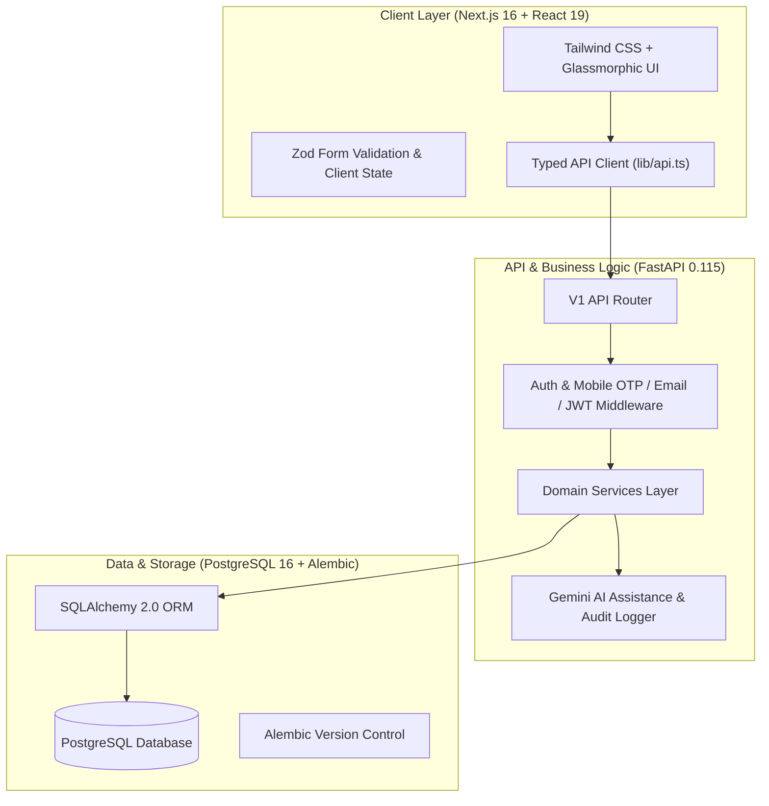

# NIRNAY: Societal Innovation Collaboration & Readiness Platform

> **Smart India Hackathon 2026** | **Problem Statement**: SIH26043  
> **Team**: CREATORZZZ  
> **Tagline**: *Right Problem. Ready Pilot. Proven Outcome.*

---

## 1. What NIRNAY Is & Core Principles

NIRNAY is a production-oriented public-sector governance and readiness platform built for SIH26043. It transforms unstructured municipal and field problem statements into standardized **Challenge Passports**, matches academic research capabilities (HEIs) and MSME solutions, and manages pilot readiness and outcome evaluation through deterministic state transitions.

### Core Architectural Principles:

1. **Facts ≠ Decisions ≠ Readiness ≠ Outcomes**:
   Operational pilot completion is kept strictly separate from evidence outcome evaluation. A completed pilot does not automatically equal proven impact.
2. **AI is Strictly Advisory**:
   Artificial Intelligence operates exclusively as a non-authoritative advisory assistant (`is_ai_advisory: true`). All domain decisions are executed by authenticated human actors.
3. **Deterministic State Transitions**:
   State transitions are governed by formal domain contracts and optimistic concurrency control (`expected_version`).
4. **Dependency-Aware Readiness**:
   If an underlying institutional commitment is withdrawn, NIRNAY preserves historical audit logs but automatically invalidates pilot readiness (`PILOT_READY` ➔ `REVIEW_REQUIRED`).
5. **5-Phase Progression Protocol**:
   - **Problem Statement Structuring & Refinement**: AI-assisted challenge drafting and clarification.
   - **Pilot Readiness Evaluation**: Multi-dimensional scoring across technical, regulatory, financial, and operational criteria.
   - **HEI & Innovator Capability Matching**: Automated algorithmic matching of academic research units and startups to challenges.
   - **Pilot Deployment & Operational Monitoring**: Milestone-based execution tracking with evidence submission.
   - **Outcome Auditing & Impact Verification**: Third-party verification, metrics evaluation, and scaling decisions.

---

## 2. System Architecture & Stack



- **Frontend**: Next.js 16 (App Router), React 19, TypeScript, Tailwind CSS v4.
- **Backend API**: FastAPI (Python 3.11/3.13), Pydantic v2, SQLAlchemy 2.0 ORM, Uvicorn.
- **Database**: PostgreSQL with Alembic migration version control.
- **Authentication & Security**: Account-based authentication, mobile OTP fallback, email auth fallback, salted PBKDF2 password hashing, opaque session token hashes (`token_hash`), CSRF headers, and server-side RBAC middleware (`PolicyService`).
- **Storage**: Storage adapter supporting S3 and MVP Ephemeral storage mode (`ALLOW_EPHEMERAL_STORAGE`).

---

## 3. Monorepo Layout

```text
Nirnay-SIH26043/
├── apps/
│   ├── web/                          # Next.js Frontend App
│   │   ├── src/app/                  # App Router pages (public, auth, & authenticated /app)
│   │   ├── src/components/           # UI Components (Shell, Passports, Readiness, Pilots)
│   │   ├── src/lib/                  # Auth Context & Typed API client
│   │   └── test/                     # Frontend ESM Test Suite (28 tests)
│   └── api/                          # FastAPI Backend App
│       ├── alembic/                  # Schema migration history
│       ├── app/                      # Models, routers, services, & policy matrix
│       └── scripts/                  # Seed scripts for demonstration data
├── packages/
│   └── contracts/                    # Canonical domain state contracts (JSON)
├── docs/                             # Engineering, architecture, & audit documentation
└── scripts/                          # Parity & setup scripts
```

---

## 4. Demo Accounts & Role-Based Testing

For evaluation and testing, the platform includes pre-seeded accounts representing key stakeholders:

- **Government / Nodal Officer**: `nodal1@gov.in` (Password: `password123`)
- **HEI Lead**: `hei1@institute.edu` (Password: `password123`)
- **Innovator / Startup**: `innovator1@startup.io` (Password: `password123`)
- **Platform Admin**: `admin1@nirnay.gov.in` (Password: `password123`)

---

## 5. Prerequisites & Local Setup Guide

### 5.1. Prerequisites
- **Node.js**: `20.x` or higher
- **Python**: `3.11` or `3.13`
- **PostgreSQL**: `15+` (or Docker Container)

### 5.2. Environment Configuration
Copy default environment variables:
```bash
cp .env.example .env
```

### 5.3. Running Backend API
```bash
cd apps/api
python3 -m venv .venv
source .venv/bin/activate
pip install -r requirements.txt
alembic upgrade head
uvicorn app.main:app --reload --port 8000
```
*API Swagger Documentation will be accessible at: `http://localhost:8000/docs`*

### 5.4. Running Frontend Application
```bash
cd apps/web
npm install
npm run dev
```
*Frontend Web Application will be accessible at: `http://localhost:3000`*

---

## 6. Verification & Quality Assurance

### Frontend Verification
```bash
cd apps/web
npm test          # Runs unit and governance tests
npm run typecheck # TypeScript compilation check
npm run lint      # ESLint static analysis
npm run build     # Production Next.js build check
```

### Backend Verification
```bash
cd apps/api
pytest            # Full Pytest test suite
```

### Contract Parity Check
```bash
python3 scripts/check-contracts.py
```

---

## 7. Important Prototype & Evaluation Disclaimer

NIRNAY is a production-oriented MVP developed for Smart India Hackathon 2026 evaluation (Problem Statement: SIH26043 by Team CREATORZZZ). Demonstration dataset records (e.g. Ranchi Urban Waste, Hazaribagh Vendor Pilot) represent synthetic evaluation scenarios and must not be interpreted as real Government of Jharkhand data, official endorsement, or measured real-world public deployment.
