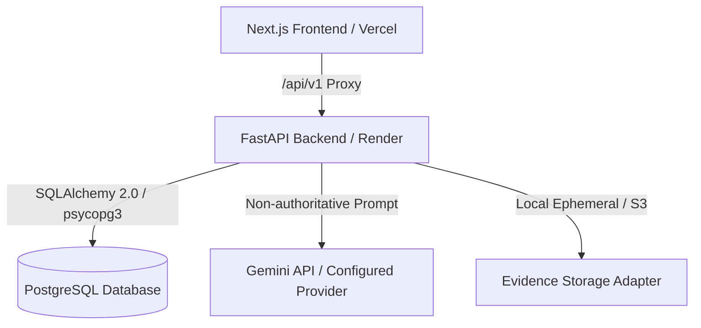

# NIRNAY

**Right Problem. Ready Pilot. Proven Outcome.**

*A societal innovation collaboration, problem qualification, and pilot readiness platform.*

| Metric / Setting | Value |
| :--- | :--- |
| **Problem Statement** | SIH26043 |
| **Team** | CREATORZZZ |
| **Canonical Repository** | `https://github.com/CREATORRADHEY/Nirnay-SIH26043` |
| **Live Frontend** | [https://nirnay-sih-26043-one.vercel.app/](https://nirnay-sih-26043-one.vercel.app/) |
| **Live API Backend** | [https://nirnay-sih26043.onrender.com/](https://nirnay-sih26043.onrender.com/) |
| **API Healthcheck** | [https://nirnay-sih26043.onrender.com/health](https://nirnay-sih26043.onrender.com/health) |

---

## 1. The Problem

Societal challenges across Indian civic sectors (such as municipal waste management, rural water supply, and cold chain logistics) often fail to achieve lasting impact due to critical structural disconnects:

1. **Scattered Submissions & Noise**: Public complaints and citizen issues are submitted in unstructured formats, making evidence verification difficult.
2. **Missing Problem Qualification Gate**: Municipal and state agencies frequently attempt to deploy costly technology innovations for routine service complaints or administrative clarity issues that require standard municipal service execution rather than innovation funding.
3. **Institutional Misalignment**: Universities (HEIs) and industry partners are often assigned to challenges without explicit, verifiable resource commitments or agreed readiness conditions.
4. **Assignment Confused with Readiness**: Assigning an institution to a problem is often mistaken for making the project ready for field pilot deployment.
5. **Pilot Completion Confused with Proven Impact**: Operational completion of a pilot phase is frequently conflated with proving validated societal impact.

---

## 2. Our Product Thesis

NIRNAY introduces a structured governance framework built on four cardinal principles:

> **Not every genuine problem is an innovation problem.**
> **Not every innovation problem is pilot-ready.**
> **Not every completed pilot proves impact.**
> **Assignment ≠ Readiness | Completion ≠ Impact**

```
FACTS (Evidence)  ──>  DECISIONS (Qualification)  ──>  READINESS (Commitments & Conditions)  ──>  OUTCOMES (Validated Impact)
```

---

## 3. End-to-End Governance Lifecycle

NIRNAY enforces a sequential 9-stage lifecycle:


1. **Report**: Citizens and innovators submit structured civic challenges with location & domain context.
2. **Evidence**: Ground-truth photos, sensor logs, or official documents are linked to the challenge.
3. **Qualification**: Government Nodal Reviewers route the challenge to one of four authoritative routes:
   - `SERVICE`: Standard municipal execution.
   - `CLARIFY`: Additional ground facts required.
   - `RESEARCH_REVIEW`: Literature / policy review.
   - `INNOVATION_CHALLENGE`: Complex challenge requiring R&D / Pilot intervention.
4. **Validation**: Verification of evidence integrity and duplicate detection.
5. **Matching**: Higher Education Institutions (HEIs) and Industry partners are matched based on active research capabilities.
6. **Commitment**: Institutions formally issue `ACCEPTED` commitments with clear deliverables.
7. **Pilot Readiness**: Automatic dependency evaluation ensures all conditions are `SATISFIED` before declaring `PILOT_READY`. If a commitment is `WITHDRAWN`, readiness automatically invalidates to `REVIEW_REQUIRED`.
8. **Pilot Execution**: Operational deployment is tracked (`PLANNED` → `ACTIVE` → `COMPLETED`).
9. **Outcome Integrity**: Final impact assessment cleanly separates `OperationalStatus` (e.g., `COMPLETED`) from `EvidenceConclusion` (e.g., `INCONCLUSIVE` vs `VALIDATED`).

---

## 4. Key Verified Capabilities

- **Challenge Passport**: Single source of truth compiling problem details, evidence history, qualification decisions, institutional commitments, readiness conditions, and outcome assessments.
- **Problem Qualification Gate**: Prevents wasteful innovation resource allocation by requiring explicit human qualification into authoritative routes.
- **HEI / Institutional Matching**: Capability-based matching engine pairing challenges with accredited institutions.
- **Commitment & Dependency Management**: Concurrency-safe version tracking for institutional resource commitments.
- **Automated Readiness Invalidation**: Automatic transition to `REVIEW_REQUIRED` when underlying commitments or conditions change.
- **Decision Assurance Engine**: Immutable audit records capturing human rationale, evidence basis, second-reviewer sign-offs, and disagreement resolutions.
- **Guided Mission Mode**: Interactive, role-aware onboardings, Mission Navigator badges, page context headers, and a 90-second Jury Tour.
- **Bounded AI Advisory**: Non-authoritative AI suggestions for challenge extraction, duplicate detection, and qualification assistance. Strictly constrained: *AI proposes → Human authorizes*.
- **Evaluation & Jury Workspace**: Interactive simulation workspace with seed scenarios for testing dependency invalidations and outcome integrity.

---

## 5. Technology Stack

| Layer | Technology | Version |
| :--- | :--- | :--- |
| **Frontend Framework** | Next.js (App Router, Turbopack) | `16.3.5` |
| **UI Library** | React / React-DOM | `19.2.8` |
| **Styling** | TailwindCSS | `^4.0` |
| **Icons** | Lucide React | `^1.45.0` |
| **Backend Framework** | FastAPI (Python 3.11 / 3.13) | `0.116.1` |
| **ASGI Server** | Uvicorn | `0.35.0` |
| **ORM & Migrations** | SQLAlchemy & Alembic | `2.0.43` / `1.16.5` |
| **Database Driver** | psycopg3 | `3.2.10` |
| **Password Hashing** | Argon2id (`argon2-cffi`) | `23.1.0` |
| **Database** | PostgreSQL | `15+` |
| **Testing** | Pytest (Backend) / Node Test Runner & Playwright (Frontend) | Pytest `8.x` / Playwright `1.63` |

---

## 6. System Architecture Summary



---

## 7. Local Quickstart

### Prerequisites
- Python `3.11` or `3.13`
- Node.js `20+` & `npm`
- PostgreSQL `15+` (or Docker)

### Backend Setup
```bash
cd apps/api
python -m venv .venv
source .venv/bin/activate
pip install -r requirements.txt
alembic upgrade head
uvicorn app.main:app --reload --port 8000
```

### Frontend Setup
```bash
cd apps/web
npm install
npm run dev
```

Visit `http://localhost:3000` for the web app and `http://localhost:8000/docs` for the interactive OpenAPI documentation.

---

## 8. Test Suite Execution & Verification

All test counts verified against current repository test suites:

- **Backend Pytest Suite**: `170 / 170 passed`
- **Frontend Unit Test Suite**: `31 / 31 passed`
- **TypeScript Typecheck**: `0 errors` (`tsc --noEmit`)
- **Next.js Production Build**: `32 / 32 routes compiled` (`npm run build`)

To run tests locally:
```bash
# Backend unit tests
cd apps/api && source .venv/bin/activate && pytest app/tests

# Frontend unit tests
cd apps/web && npm test -- --run

# Full typecheck & build
cd apps/web && npm run typecheck && npm run build
```

---

## 9. Release & MVP Limitations

- **Current Release Tag**: `sih26043-final-v1.1` (Validated MVP Release)
- **Current Main SHA**: `0d4dd7179040c06497f5a9e33bfdf9b0cbe8ec4e`
- **MVP Storage Limitation**: In the default MVP deployment configuration (`STORAGE_PROVIDER=local`, `ALLOW_EPHEMERAL_STORAGE=true`), structured workflow records (challenges, qualifications, commitments, audit trails) persist permanently in PostgreSQL, but uploaded binary evidence files remain in local ephemeral storage and may be reset upon backend instance container restarts. Production deployment requires an S3-compatible object store adapter.

---

## 10. Complete Documentation System

Detailed documentation is available in the [`docs/`](./docs/README.md) directory:

- [📚 Documentation Index (`docs/README.md`)](./docs/README.md)
- [00-Overview](./docs/00-overview/PROJECT_OVERVIEW.md)
- [01-Product](./docs/01-product/END_TO_END_WORKFLOW.md)
- [02-System Architecture](./docs/02-system/SYSTEM_ARCHITECTURE.md)
- [03-AI Architecture & Boundaries](./docs/03-ai/AI_ARCHITECTURE.md)
- [04-Security & Governance](./docs/04-security/SECURITY_MODEL.md)
- [05-Deployment & Operations](./docs/05-deployment/LOCAL_DEVELOPMENT.md)
- [06-Validation & Test Results](./docs/06-validation/VALIDATION_RESULTS.md)
- [07-Demo & Jury Walkthrough](./docs/07-demo/JURY_WALKTHROUGH.md)
- [08-Release History & Roadmap](./docs/08-release/RELEASE_HISTORY.md)
