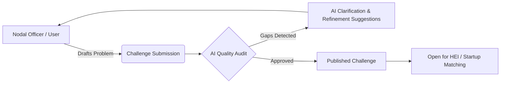
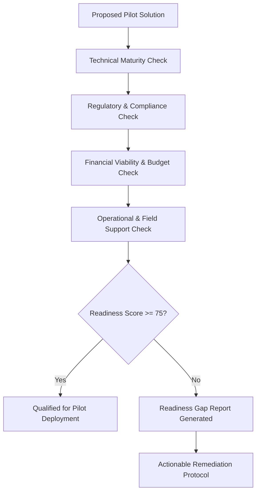
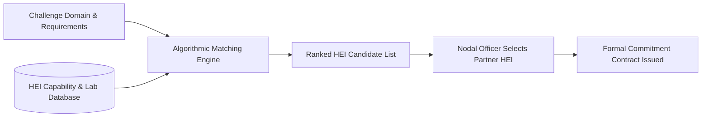
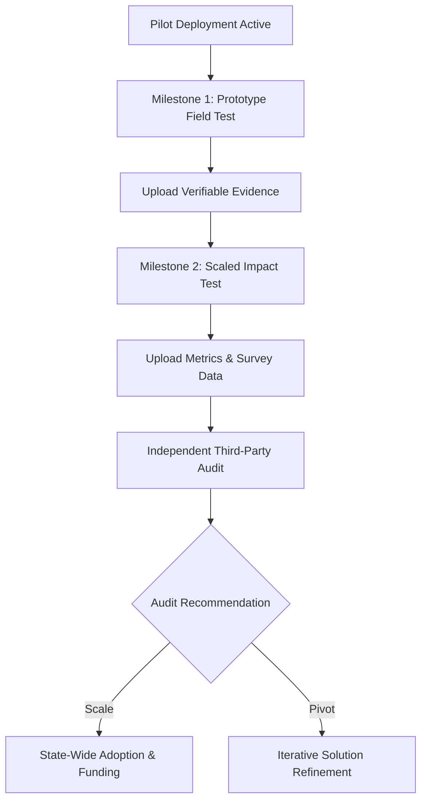

# NIRNAY: Societal Innovation Collaboration & Readiness Platform

<<<<<<< HEAD
> **Smart India Hackathon 2026** | **Problem Statement**: SIH26043  
> **Team**: CREATORZZZ  
> **Tagline**: *Right Problem. Ready Pilot. Proven Outcome.*
=======
**Societal Innovation Collaboration & Readiness Platform**
>>>>>>> origin/release/sih-final-rc

---

<<<<<<< HEAD
## 1. Executive Summary

**NIRNAY** is an AI-powered, end-to-end Societal Innovation Collaboration and Pilot-Readiness Platform engineered for government departments, Higher Education Institutions (HEIs), innovators, and social impact investors. 

The platform bridges the gap between complex public sector societal challenges and deployable technological solutions by enforcing a strict **5-Phase Progression Protocol**:

1. **Problem Statement Structuring & Refinement**: AI-assisted challenge drafting and clarification.
2. **Pilot Readiness Evaluation**: Multi-dimensional scoring across technical, regulatory, financial, and operational criteria.
3. **HEI & Innovator Capability Matching**: Automated algorithmic matching of academic research units and startups to challenges.
4. **Pilot Deployment & Operational Monitoring**: Milestone-based execution tracking with evidence submission.
5. **Outcome Auditing & Impact Verification**: Third-party verification, metrics evaluation, and scaling decisions.

---

## 2. Platform System Architecture


---

## 3. Core Platform Workflows & Flowcharts

### 3.1. Challenge Submission & Refinement Flow



### 3.2. Pilot Readiness & Qualification Workflow



### 3.3. HEI Capability Matching Engine



### 3.4. Pilot Execution & Outcome Auditing Flow



---

## 4. Monorepo Directory Structure
=======
**Tagline**:  
*Right Problem. Ready Pilot. Proven Outcome.*

---

## 1. What NIRNAY Is

NIRNAY is a production-oriented public-sector governance and readiness platform built for SIH26043. It transforms unstructured municipal and field problem statements into standardized **Challenge Passports**, matches academic research capabilities (HEIs) and MSME solutions, and manages pilot readiness and outcome evaluation through deterministic state transitions.

### Core Architectural Principles:

1. **Facts ≠ Decisions ≠ Readiness ≠ Outcomes**:
   Operational pilot completion is kept strictly separate from evidence outcome evaluation. A completed pilot does not automatically equal proven impact.
2. **AI is Strictly Advisory**:
   Artificial Intelligence operates exclusively as a non-authoritative advisory assistant (`is_ai_advisory: true`). All domain decisions are executed by authenticated human actors.
3. **Deterministic State Transitions**:
   State transitions are governed by formal domain contracts and optimistic concurrency control (`expected_version`).
4. **Dependency-Aware Readiness**:
   If an underlying institutional commitment is withdrawn, NIRNAY preserves historical audit logs but automatically invalidates pilot readiness (`PILOT_READY` ➔ `REVIEW_REQUIRED`).

---

## 2. System Architecture & Stack

- **Frontend**: Next.js 16 (App Router), React 19, TypeScript, Tailwind CSS v4.
- **Backend API**: FastAPI (Python 3.11/3.13), Pydantic v2, SQLAlchemy 2.0 ORM.
- **Database**: PostgreSQL (Supabase / Render) with Alembic migration version control.
- **Authentication & Security**: Account-based authentication, salted PBKDF2 password hashing, opaque session token hashes (`token_hash`), CSRF headers, and server-side RBAC middleware (`PolicyService`).

---

## 3. Monorepo Layout
>>>>>>> origin/release/sih-final-rc

```text
Nirnay-SIH26043/
├── apps/
<<<<<<< HEAD
│   ├── web/                        # Next.js 16 Frontend
│   │   ├── src/
│   │   │   ├── app/                # App Router (30 Pages & Routes)
│   │   │   │   ├── (auth)/         # Login, Register, Forgot Password
│   │   │   │   ├── app/            # Main Dashboard & Sub-modules
│   │   │   │   │   ├── admin/      # Governance, Users, AI Logs
│   │   │   │   │   ├── challenges/ # Challenge Management
│   │   │   │   │   ├── hei-matching/# HEI Matching Engine
│   │   │   │   │   ├── pilots/     # Pilot Operations & Tracking
│   │   │   │   │   ├── readiness/  # Readiness Evaluation
│   │   │   │   │   └── review/     # Nodal Officer Review Queue
│   │   │   └── lib/                # API Client & Helpers
│   │   ├── test/                   # ESM Frontend Unit Tests
│   │   └── package.json
│   │
│   └── api/                        # FastAPI Backend
│       ├── app/
│       │   ├── api/v1/             # REST Endpoints (10 Modules)
│       │   ├── core/               # Security, Database Config, Auth
│       │   ├── models/             # SQLAlchemy ORM Models (25 Entities)
│       │   ├── schemas/            # Pydantic Request/Response Schemas
│       │   └── services/           # Domain Business Logic & AI Engines
│       ├── alembic/                # Database Migrations
│       ├── requirements.txt
│       └── pytest.ini
│
├── .github/
│   └── workflows/
│       └── ci.yml                  # Unified GitHub Actions Pipeline
├── docker-compose.yml              # Local Development Infrastructure
└── README.md
=======
│   ├── web/                          # Next.js Frontend App
│   │   ├── src/app/                  # App Router pages (public, auth, & authenticated /app)
│   │   ├── src/components/           # UI Components (Shell, Passports, Readiness, Pilots)
│   │   ├── src/lib/                  # Auth Context & Typed API client
│   │   └── test/                     # Frontend ESM Test Suite (28 tests)
│   └── api/                          # FastAPI Backend App
│       ├── alembic/                  # Schema migration history
│       ├── app/                      # Models, routers, services, & policy matrix
│       └── scripts/                  # Seed scripts for demonstration data
├── packages/
│   └── contracts/                    # Canonical domain state contracts (JSON)
├── docs/                             # Engineering, architecture, & audit documentation
└── scripts/                          # Parity & setup scripts
>>>>>>> origin/release/sih-final-rc
```

---

<<<<<<< HEAD
## 5. Domain Entities & Database Schema

The backend uses **SQLAlchemy 2.0 ORM** backed by **Alembic** migrations:

| Module | Core Models / Tables | Description |
| :--- | :--- | :--- |
| **Identity & Auth** | `Account`, `Actor`, `Organization`, `AuthSession`, `AuthToken` | User accounts, role-based permissions (Admin, Nodal Officer, HEI Lead, Innovator), and OTP auth. |
| **Challenges** | `Challenge`, `Clarification`, `ChallengeHEICandidate` | Societal challenge problem statements, sector tags, target budget, and clarification history. |
| **Readiness** | `ReadinessCondition`, `ReadinessDecision` | Multi-dimensional readiness scoring metrics and threshold evaluation. |
| **HEI Matching** | `HEICapability`, `ChallengeHEICandidate` | HEI laboratory capacities, research specializations, and algorithmic match scores. |
| **Pilots** | `Pilot`, `PilotEvidencePlan`, `PilotOperationalState` | Active pilot projects, deployment locations, operational status transitions, and timeline tracking. |
| **Commitments** | `Commitment`, `Evidence`, `OutcomeAssessment` | Financial/resource commitments, uploaded proof of work, and third-party outcome assessments. |
| **Governance** | `AIAuditLog`, `SecurityAuditLog`, `Notification` | Transparent AI prompt/response logging, system audit trails, and user notification events. |

---

## 6. API Endpoint Reference

The backend exposes a structured **REST API (v1)** at `http://localhost:8000/api/v1`:

| Router | Method | Path | Description |
| :--- | :--- | :--- | :--- |
| **Health** | `GET` | `/health` | System health check and database connectivity. |
| **Challenges** | `GET`, `POST` | `/api/v1/challenges` | List, search, and submit societal challenges. |
| | `GET` | `/api/v1/challenges/{id}` | Detailed challenge profile and clarifications. |
| **Readiness** | `POST` | `/api/v1/readiness/evaluate` | Calculate multi-dimensional pilot readiness score. |
| **HEI Matching**| `GET` | `/api/v1/hei-matching/recommend` | Retrieve AI-ranked HEI capability match suggestions. |
| **Qualification**| `POST` | `/api/v1/qualification/decide` | Record formal qualification or gap remediation plan. |
| **Pilots** | `GET`, `POST` | `/api/v1/pilots` | Manage pilot deployments and operational states. |
| **Commitments** | `GET`, `POST` | `/api/v1/commitments` | Register resource commitments and upload evidence. |
| **Review Queue**| `GET` | `/api/v1/review-queue` | Nodal officer pending challenge & pilot review queue. |
| **AI Assistance**| `POST` | `/api/v1/ai/assist` | Real-time AI challenge structuring & clarification suggestions. |
| **Admin** | `GET` | `/api/v1/admin/users`, `/audit` | Administrative user management and audit trails. |

---

## 7. Technology Stack

- **Frontend**: Next.js 16 (App Router + Turbopack), React 19, TypeScript 5, Tailwind CSS v4, Lucide Icons
- **Backend**: Python 3.11/3.12, FastAPI 0.115, Pydantic v2, SQLAlchemy 2.0, Uvicorn
- **Database & Migrations**: PostgreSQL 16, Alembic
- **AI Integration**: Google Gemini API (with deterministic fallback engine)
- **DevOps & CI**: GitHub Actions (Node 20 + Python 3.11), Docker Compose

---

## 8. Quickstart & Local Setup Guide

### 8.1. Prerequisites
- **Node.js**: `20.x` or higher
- **Python**: `3.11` or `3.12`
- **Docker & Docker Compose**

### 8.2. Environment Configuration
Copy the default environment variables:
```bash
cp .env.example .env
```

### 8.3. Start PostgreSQL Database
```bash
docker compose up -d postgres
```
=======
## 4. Prerequisites & Setup

- **Node.js**: 20+
- **Python**: 3.11+
- **Database**: PostgreSQL 15+

### Running Frontend:
>>>>>>> origin/release/sih-final-rc

### 8.4. Setup and Run Backend API
```bash
cd apps/api
python3 -m venv .venv
source .venv/bin/activate
pip install -r requirements.txt -r requirements-dev.txt
alembic upgrade head
uvicorn app.main:app --reload --port 8000
```
*API Swagger Documentation will be accessible at: `http://localhost:8000/docs`*

### 8.5. Setup and Run Frontend Application
```bash
cd apps/web
npm install
npm run dev
```
*Frontend Web Application will be accessible at: `http://localhost:3000`*

<<<<<<< HEAD
---

## 9. Testing & Quality Assurance

### Frontend Verification
```bash
cd apps/web
npm run lint         # ESLint check
npm run typecheck    # TypeScript compilation check
npm run test         # Native Node 20 ESM unit test suite
npm run build        # Production Next.js Turbopack build
```

### Backend Test Suite
```bash
cd apps/api
pytest               # Run full Pytest test suite
```

### Contract Parity Check
```bash
python3 scripts/check-contracts.py
=======
Verification scripts:

```bash
npm test          # Runs 28 unit and governance tests
npm run typecheck # TypeScript compilation check
npm run lint      # ESLint static analysis
npm run build     # Production Next.js build check
```

### Running Backend:

```bash
cd apps/api
source .venv/bin/activate
pip install -r requirements.txt
uvicorn app.main:app --reload
```

Verification scripts:

```bash
pytest            # Runs 143 backend domain and API tests
>>>>>>> origin/release/sih-final-rc
```

---

<<<<<<< HEAD
## 10. Important Prototype Disclaimer

This repository is developed for **Smart India Hackathon 2026 (Problem Statement: SIH26043)** by **Team CREATORZZZ**.  
Seeded organizations, challenges, and metrics are used for demonstration purposes.

---

*NIRNAY — Right Problem. Ready Pilot. Proven Outcome.*
=======
## 5. Important Prototype & Evaluation Disclaimer

NIRNAY is a production-oriented MVP developed for Smart India Hackathon evaluation. Demonstration dataset records (e.g. Ranchi Urban Waste, Hazaribagh Vendor Pilot) represent synthetic evaluation scenarios and must not be interpreted as real Government of Jharkhand data, official endorsement, or measured real-world public deployment.
>>>>>>> origin/release/sih-final-rc
