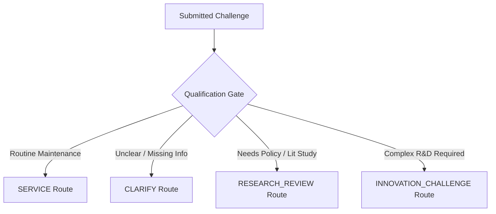

# Product Thesis — NIRNAY

## 1. Core Product Thesis

NIRNAY is built upon a fundamental thesis for civic innovation management:

> **Not every genuine problem is an innovation problem.**  
> **Not every innovation problem is pilot-ready.**  
> **Not every completed pilot proves impact.**  
> **Assignment ≠ Readiness \| Completion ≠ Impact**

---

## 2. The Four Domain Dimensions

NIRNAY establishes a strict conceptual separation across four distinct layers:

```
FACTS  ──>  DECISIONS  ──>  READINESS  ──>  OUTCOMES
```

| Layer | Definition | Domain Entity | Example |
| :--- | :--- | :--- | :--- |
| **1. FACTS** | Empirical ground truth provided by citizens, sensors, or field staff. | `Challenge`, `Evidence` | Water contamination photos and pH sensor logs in Ward 12. |
| **2. DECISIONS** | Authoritative human governance determinations regarding how to address the challenge. | `QualificationDecision` | Routing the challenge to `INNOVATION_CHALLENGE` rather than standard `SERVICE`. |
| **3. READINESS** | Verification that all required conditions and commitments are currently satisfied. | `Commitment`, `ReadinessCondition`, `ReadinessDecision` | HEI water lab commitment `ACCEPTED` and site access condition `SATISFIED`. |
| **4. OUTCOMES** | Independent evaluation of whether the executed pilot proved societal impact. | `PilotOperationalState`, `OutcomeAssessment` | Pilot execution `COMPLETED`, but impact evidence `INCONCLUSIVE`. |

---

## 3. The Problem Qualification Gate

The **Problem Qualification Gate** is NIRNAY's primary filter against resource misallocation. When a societal challenge is submitted, a Government Nodal Reviewer must evaluate the ground evidence and assign it to exactly one of four canonical routes:



1. **`SERVICE`**: Problem requires routine municipal service execution (e.g., clearing a blocked storm drain). No innovation funding or academic matching is permitted.
2. **`CLARIFY`**: Information is incomplete. The reporter must provide additional ground evidence or spatial details.
3. **`RESEARCH_REVIEW`**: Problem requires literature review or regulatory analysis before tech interventions can be evaluated.
4. **`INNOVATION_CHALLENGE`**: Problem is verified as a complex societal challenge suitable for institutional capability matching and field pilot deployment.

---

## 4. Key Differentiators

### A. Dynamic Readiness Invalidation
In conventional project management systems, a status flag like "Approved" is static. NIRNAY's readiness engine continuously computes dependency status. If an institutional commitment transitions from `ACCEPTED` to `WITHDRAWN`, the platform automatically invalidates `PILOT_READY` to `REVIEW_REQUIRED`.

### B. Structural Separation of Completion vs. Impact
NIRNAY enforces two independent fields on pilot evaluation:
- `OperationalStatus`: Describes physical execution (`PLANNED`, `ACTIVE`, `COMPLETED`, `STOPPED`).
- `EvidenceConclusion`: Describes impact validation (`NOT_REVIEWED`, `VALIDATED`, `ITERATE`, `INCONCLUSIVE`).

This ensures that a pilot can be operationally `COMPLETED` while remaining scientifically or sociologically `INCONCLUSIVE`, preventing unverified claims of success.
