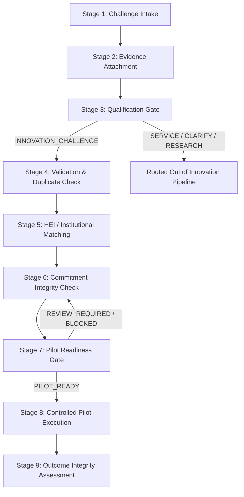

# End-to-End Workflow — NIRNAY

## 1. Governance Pipeline Flow

NIRNAY enforces a 9-stage sequential governance pipeline. Each stage requires human authorization and evidence validation before advancing.

---

## 2. Detailed Stage Breakdown

### Stage 1: Challenge Intake
- **Actor**: Citizen / Innovator / Nodal Officer
- **Action**: User submits structured challenge details including title, domain tag (e.g. `WATER_SUPPLY`, `WASTE_MANAGEMENT`), district/municipality location, and description.
- **Output**: Challenge created in `SUBMITTED` state with unique tracking code (e.g., `CHG-2026-0042`).

### Stage 2: Evidence Attachment
- **Actor**: Reporter / Field Inspector
- **Action**: Evidence objects (photographs, laboratory reports, GIS coordinates, sensor readings) are attached to the challenge record.
- **Output**: Verified `Evidence` items attached to Challenge Passport.

### Stage 3: Problem Qualification Gate
- **Actor**: Government Nodal Reviewer
- **Action**: Human reviewer evaluates ground evidence and selects one of four canonical routes:
  - `SERVICE`: Sent to standard municipal maintenance.
  - `CLARIFY`: Sent back for additional evidence.
  - `RESEARCH_REVIEW`: Sent for policy/academic review.
  - `INNOVATION_CHALLENGE`: Advanced to institutional matching.
- **Output**: Recorded `QualificationDecision` with human rationale and criteria evaluation.

### Stage 4: Verification & Duplicate Check
- **Actor**: Government Nodal Reviewer + AI Advisory
- **Action**: System compares challenge against active database to detect duplicates. Nodal reviewer verifies problem scope.
- **Output**: Qualification confirmed and duplicate status cleared.

### Stage 5: HEI & Institutional Matching
- **Actor**: Government Nodal Reviewer
- **Action**: System checks active HEI/Industry research capability registry. Reviewer creates candidate match entries (`ChallengeHEICandidate`).
- **Output**: Candidates notified and candidate state set to `PROPOSED` or `OFFERED`.

### Stage 6: Commitment Integrity Check
- **Actor**: HEI Faculty / Industry Partner Lead
- **Action**: Institution reviews candidate requirements and formally issues a `Commitment` record.
- **State Transition**: `PROPOSED` → `ACCEPTED` (or `DECLINED` / `WITHDRAWN`).
- **Output**: Versioned commitment record capturing committed resources and deliverables.

### Stage 7: Pilot Readiness Gate
- **Actor**: Government Nodal Reviewer + Dynamic Readiness Engine
- **Action**: Platform verifies that all required readiness conditions are `SATISFIED` and commitments remain `ACCEPTED`.
- **Automatic Invalidation**: If an accepted commitment transitions to `WITHDRAWN`, the system automatically recalculates `ReadinessStatus` to `REVIEW_REQUIRED`.
- **Output**: `ReadinessDecision` created (`PILOT_READY` or `BLOCKED`).

### Stage 8: Controlled Pilot Execution
- **Actor**: HEI Lead + Government Nodal Officer
- **Action**: Pilot project created (`Pilot`). Operational state transitions from `PLANNED` → `ACTIVE` → `COMPLETED` (or `STOPPED`). Evidence plans are recorded.
- **Output**: Logged operational history in `PilotOperationalState`.

### Stage 9: Outcome Integrity Assessment
- **Actor**: Government Nodal Reviewer / Independent Evaluator
- **Action**: Reviewer evaluates field evidence against baseline definitions and records an `OutcomeAssessment`.
- **Outcome States**: Evaluates `EvidenceConclusion` (`VALIDATED`, `ITERATE`, `INCONCLUSIVE`).
- **Output**: Final Challenge Passport closure with full audit trail.
