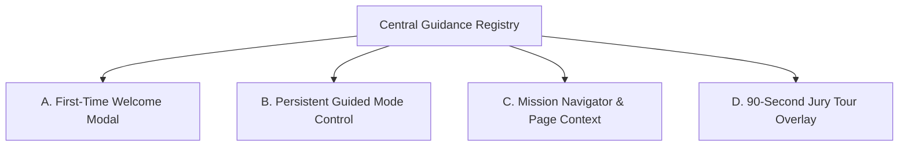

# Guided Mission Mode — NIRNAY

## 1. Overview & Core Principle

**NIRNAY Guided Mission Mode** is an integrated, role-aware navigation and onboarding engine designed to prevent user confusion when moving across complex governance workflows.

Rather than relying on intrusive SaaS popups, Guided Mission Mode builds upon four fundamental questions:

> **WHERE AM I?**  
> **WHY DOES THIS STAGE EXIST?**  
> **WHAT SHOULD I DO NOW?**  
> **WHAT HAPPENS NEXT?**

---

## 2. Four Connected UX Layers

Guided Mission Mode consists of four unified visual components that share a single central guidance registry (`apps/web/src/lib/guidance/`):

### Layer A: First-Time Guided Tour
- Appears on the user's first visit to `/app`.
- Restrained welcome card explaining NIRNAY's mission.
- Actions: `Start Guided Tour` or `Explore Myself`.
- Persists dismissal state in `localStorage` under `nirnay_guidance_v1`.

### Layer B: Persistent Guided Mode Control
- Accessible via the `Guided Mode` compass button in the top navigation header.
- Opens a slide-out panel offering:
  - *Continue my workflow*
  - *Take my role tour*
  - *90-sec platform tour*
  - *Explain this page*
  - *Restart guidance*

### Layer C: Contextual Page Guidance & Mission Navigator
- **Page Context Header**: Lightweight header on major workflow screens displaying current stage number, previous stage, next stage, and a `Why this stage?` dialog trigger.
- **Mission Navigator**: Compact progress card displaying active mission steps, stage status indicators, and next actionable steps.
- **`👁️ View Page` Option**: Allows users to temporarily hide the dark spotlight overlay to inspect and interact with the full page screen before clicking `Resume Tour ➔`.

### Layer D: 90-Second Jury Tour
- Dedicated, zero-mutation demo flow created specifically for hackathon evaluation jury members.
- Navigates through key milestone screens:
  1. Problem Qualification Gate
  2. Challenge Passport
  3. Decision Assurance Engine
  4. Pilot Readiness Dependencies
  5. Dependency Invalidation (Scenario A)
  6. Outcome Integrity (Scenario B: `COMPLETED` ≠ Validated Impact)
  7. AI Authority Boundaries

---

## 3. Role-Aware Journeys

Journeys dynamically adapt based on the user's active role:

| Persona | Guided Journey Sequence | Key Takeaway |
| :--- | :--- | :--- |
| **Citizen / Innovator** | Dashboard → Report Challenge → Add Evidence → Passport → Track Status | Civic reporting, evidence linkage, lifecycle visibility. |
| **Government Nodal** | Review Queue → Qualification → Passport → HEI Match → Readiness → Decision Assurance | Qualification routes, human authority, readiness gates. |
| **HEI / Industry** | Matching Opportunities → Commitment → Conditions → Pilot → Outcome | Assignment vs Commitment vs Readiness vs Impact. |
| **Admin** | Organizations → Users → Audit Logs → AI Governance | Organization verification, RBAC, audit logging. |
| **Jury / Evaluator** | Qualification → Passport → Decision Assurance → Readiness → Invalidation → Outcome | Invalidation logic, outcome integrity, AI boundaries. |

---

## 4. Technical Architecture & Safety Boundaries

- **State Persistence**: Pure client-side `localStorage` state management (`nirnay_guidance_v1`). Zero backend persistence.
- **Selector Stability**: Uses dedicated `data-tour` attributes (e.g. `data-tour="qualification-nav"`).
- **Viewport Target Measurement**: Uses viewport-relative `getBoundingClientRect()` calculations to position the spotlight ring and guidance card accurately without layout thrashing.
- **Accessibility**: Includes keyboard navigation (`Escape` closes, `ArrowRight`/`ArrowLeft` navigates), `aria-modal`, `aria-live`, and focus trapping.
- **Safety Guarantee**: Guidance engine performs DOM measurement and navigation **only**. Guidance **NEVER** automatically submits forms, alters qualification routes, accepts commitments, or mutates database state.
