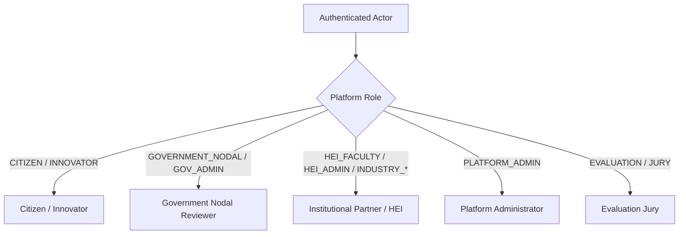

# User Roles & Stakeholders — NIRNAY

## 1. Role Architecture Overview

NIRNAY implements a strict, multi-tenant Role-Based Access Control (RBAC) matrix built into both the FastAPI backend (`Actor` & `Account` models) and the Next.js frontend (`useAuth` context).

The system maps core backend user roles into five primary experience personas:

---

## 2. Detailed Role Specifications

### A. Citizen / Innovator (`CITIZEN`, `INNOVATOR`)
- **Purpose**: Represents local citizens, community representatives, or individual innovators reporting civic problems.
- **Available Actions**:
  - Submit new civic challenges (`/app/challenges/new`).
  - Attach ground-truth evidence (photos, documents, spatial markers).
  - View public Challenge Passport details.
  - Track challenge qualification and progress status.
- **Restricted Actions**: Cannot qualify challenges, cannot accept institutional commitments, cannot mark readiness, cannot authorize pilots.

### B. Government Nodal Reviewer (`GOVERNMENT_NODAL`, `GOV_ADMIN`)
- **Purpose**: Represents municipal nodal officers, state department leads, and civic administrators.
- **Available Actions**:
  - Access Government Review Queue (`/app/review`).
  - Execute Problem Qualification Decisions (`SERVICE`, `CLARIFY`, `RESEARCH_REVIEW`, `INNOVATION_CHALLENGE`).
  - Request additional evidence or clarification from reporters.
  - Review candidate HEI matches and issue pilot authorization decisions.
  - Mark pilot readiness status (`PILOT_READY`, `BLOCKED`, `REVIEW_REQUIRED`).
- **Restricted Actions**: Cannot issue institutional commitments on behalf of HEIs; cannot bypass qualification gates.

### C. Institutional Partner / HEI (`HEI_FACULTY`, `HEI_ADMIN`, `INDUSTRY_MEMBER`, `INDUSTRY_ADMIN`)
- **Purpose**: Accredited Higher Education Institutions (universities, IITs, NITs) and Industry/MSME partners.
- **Available Actions**:
  - View matched innovation challenges (`/app/hei-matching`).
  - Maintain organizational capability profiles.
  - Formally issue, accept, or withdraw resource commitments (`PROPOSED`, `OFFERED`, `ACCEPTED`, `WITHDRAWN`).
  - Define pilot evidence plans (baseline data, denominator metrics).
  - Record operational execution status.
- **Restricted Actions**: Cannot self-qualify problems into `INNOVATION_CHALLENGE`; cannot override government readiness decisions.

### D. Platform Administrator (`PLATFORM_ADMIN`)
- **Purpose**: System administrators responsible for platform health and organization governance.
- **Available Actions**:
  - Manage organization onboarding and verification (`/app/admin/organizations`).
  - Manage user accounts and role assignments (`/app/admin/users`).
  - Inspect platform security and audit logs (`/app/admin/audit`).
  - Monitor AI operational bounds and token usage (`/app/admin/ai`).
- **Restricted Actions**: Cannot alter historical audit logs or overwrite decision assurance receipts.

### E. Evaluation Jury & Auditor (`JURY_EVALUATOR`, `AUDITOR`)
- **Purpose**: Independent evaluation jury panel members, academic auditors, and hackathon judges.
- **Available Actions**:
  - Access Practical Jury Evaluation Workspace (`/app/evaluation`).
  - Trigger synthetic test scenarios (Scenario A invalidation, Scenario B outcome integrity).
  - Perform second-reviewer decision assurance checks.
  - File disagreement resolution reports.
  - Run the 90-second Jury Architecture Tour.
- **Restricted Actions**: Cannot mutate real production application data outside controlled evaluation workspaces.

---

## 3. RBAC Matrix Summary

| Action / Endpoint | Citizen | Gov Nodal | HEI / Industry | Admin | Jury |
| :--- | :---: | :---: | :---: | :---: | :---: |
| **Submit Challenge** | ✅ | ✅ | ❌ | ✅ | ❌ |
| **Qualify Problem** | ❌ | ✅ | ❌ | ✅ | ❌ |
| **Issue Candidate Match** | ❌ | ✅ | ❌ | ✅ | ❌ |
| **Accept Commitment** | ❌ | ❌ | ✅ | ✅ | ❌ |
| **Set Readiness Status** | ❌ | ✅ | ❌ | ✅ | ❌ |
| **Update Pilot Execution** | ❌ | ✅ | ✅ | ✅ | ❌ |
| **Submit Outcome Assessment** | ❌ | ✅ | ❌ | ✅ | ❌ |
| **Second Review Assurance** | ❌ | ❌ | ❌ | ✅ | ✅ |
| **Admin System Operations** | ❌ | ❌ | ❌ | ✅ | ❌ |
