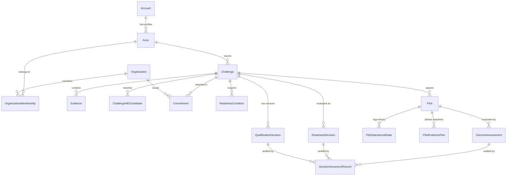

# Database & Data Model — NIRNAY

## 1. Entity Relationship Overview

NIRNAY uses a relational database schema implemented in PostgreSQL via SQLAlchemy ORM models.

---

## 2. Core Entities

1. **`Account` & `Actor`**: User credentials (`email`, `argon2_hash`) and platform persona details (`platform_role`, `display_name`, `organization_id`).
2. **`Organization` & `OrganizationMembership`**: Government departments, universities (HEIs), and industry enterprises.
3. **`Challenge`**: Societal problem record (`title`, `description`, `domain_tag`, `district`, `status`, `current_qualification_id`).
4. **`Evidence`**: Verified files and ground evidence attached to challenges.
5. **`QualificationDecision`**: Versioned qualification records (`route`, `rationale`, `criteria_evaluation`, `version`).
6. **`Commitment`**: Institutional resource promises (`commitment_type`, `status`, `expected_version`).
7. **`ReadinessCondition` & `ReadinessDecision`**: Precondition checks (`condition_type`, `status`) and overall readiness evaluations (`readiness_status`).
8. **`Pilot` & `PilotOperationalState`**: Field deployment records (`operational_status`, `start_date`, `end_date`).
9. **`OutcomeAssessment`**: Impact evaluations (`evidence_conclusion`, `reviewed_by_actor_id`, `findings`).
10. **`DecisionAssuranceRecord` & `DecisionReviewRequest`**: Audit logs capturing human rationales, evidence bases, second reviews, and disagreement resolutions.

---

## 3. Alembic Migration History

The database schema is managed via Alembic migrations:

| Migration File | Description |
| :--- | :--- |
| `001_identity_foundation.py` | Account, Actor, Organization baseline tables. |
| `002_challenge_evidence.py` | Challenge and Evidence schema. |
| `003_qualification_decision.py` | Versioned Qualification Decision table. |
| `004_hei_capability_matching.py` | HEI Capability & Candidate matching tables. |
| `005_commitment_integrity.py` | Commitment tracking with concurrency control. |
| `006_readiness_integrity.py` | Readiness conditions & readiness decision tables. |
| `007_pilot_outcome_foundation.py` | Pilot execution and Outcome Assessment schema. |
| `008_authentication_foundation.py` | Auth sessions, tokens, and password reset. |
| `009_auth_security_hardening.py` | Argon2id session security & cookie hardening. |
| `010_p2_workflows.py` | Clarification requests and notifications. |
| `011_ai_assistance_audit.py` | AI audit log and prompt tracking. |
| `012_p4b_governance_admin.py` | Security audit log and admin controls. |
| `013_decision_assurance.py` | **(HEAD)** Decision assurance & second review tables. |
