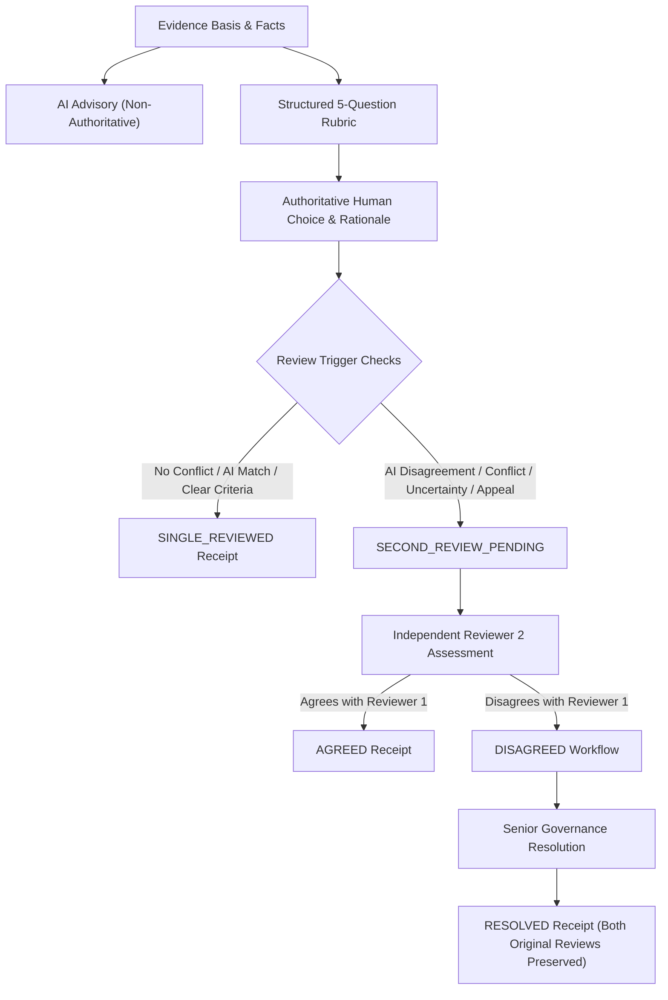

# NIRNAY — DECISION ASSURANCE MODEL (P5.2 SPECIFICATION)

**Project:** NIRNAY — Societal Innovation Collaboration & Readiness Platform  
**Problem Statement:** SIH26043  
**Team:** CREATORZZZ  
**Phase:** P5.2 Decision Assurance Architecture  

---

## 1. CORE GOVERNANCE PHILOSOPHY

> **"WE DO NOT BLINDLY TRUST A REVIEWER. WE TRUST A REVIEWABLE DECISION PROCESS."**

NIRNAY rejects the premise that human decision-makers are infallible or that artificial intelligence can dictate public policy choices. Instead, NIRNAY establishes a **Decision Assurance Layer** around authoritative governance gates (Qualification, Pilot Readiness, and Outcome Conclusion).

Every authoritative decision is:
- **EVIDENCE-BACKED**: Mandatory references to attached citizen submissions, uploaded files, and field notes.
- **CRITERIA-BASED**: Constrained by structured 5-point evaluation rubrics.
- **RATIONALE-REQUIRED**: Validated minimum meaningful human explanation (rejecting generic "ok" or "approved").
- **REVIEWABLE**: Triggered independent second-review workflow for ambiguous or disputed cases.
- **APPEALABLE**: Stakeholder review requests create append-only review workflows without overwriting historical truth.
- **VERSIONED & AUDITABLE**: Immutable version chain backed by PostgreSQL transactions.

---

## 2. DECISION ASSURANCE LIFECYCLE FLOW

---

## 3. CANONICAL STATE PRESERVATION

Decision Assurance functions as a governance metadata layer *around* canonical domain decisions. Existing domain enums remain strictly preserved without alteration:

- **QualificationRoute:** `SERVICE`, `CLARIFY`, `RESEARCH_REVIEW`, `INNOVATION_CHALLENGE`
- **CommitmentStatus:** `PROPOSED`, `OFFERED`, `ACCEPTED`, `DECLINED`, `WITHDRAWN`, `EXPIRED`
- **ConditionStatus:** `SATISFIED`, `UNSATISFIED`, `UNKNOWN`, `DISPUTED`, `EXPIRED`
- **ReadinessStatus:** `BLOCKED`, `REVIEW_READY`, `PILOT_READY`, `REVIEW_REQUIRED`
- **OperationalStatus:** `PLANNED`, `ACTIVE`, `COMPLETED`, `STOPPED`
- **EvidenceConclusion:** `NOT_REVIEWED`, `VALIDATED`, `ITERATE`, `INCONCLUSIVE`

No synthetic "correctness scores", "trust scores", or "AI approval" fields are permitted.

---

## 4. JURY-FACING EXPLANATION

### Question:
*"How do you know the human reviewer is correct?"*

### Answer:
*"NIRNAY does not assume a human is automatically correct. It requires the reviewer to use a defined rubric, reference evidence and record a rationale. Ambiguous or disputed cases can require an independent review, and affected stakeholders can request review when new evidence appears. Every decision and revision remains auditable."*

*"We do not trust a reviewer blindly; we trust a reviewable process."*
