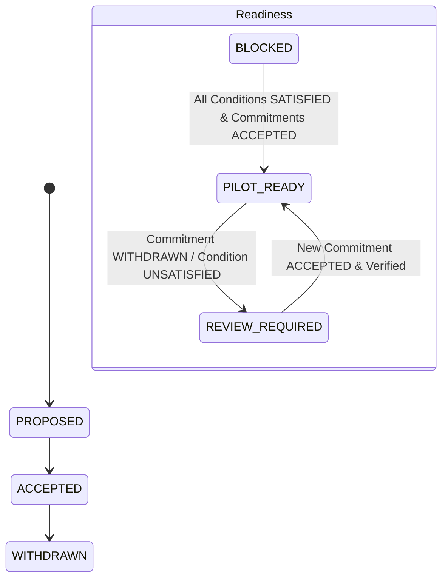

# Domain Model — NIRNAY

## 1. Domain Enums (Canonical Contracts)

All domain state transitions are strictly governed by Python string enums defined in `app/core/enums.py` and validated against `packages/contracts/domain-states.json`:

```
Domain State Contract Map:

[QualificationRoute]
  ├── SERVICE
  ├── CLARIFY
  ├── RESEARCH_REVIEW
  └── INNOVATION_CHALLENGE

[CommitmentStatus]
  ├── PROPOSED
  ├── OFFERED
  ├── ACCEPTED
  ├── DECLINED
  ├── WITHDRAWN
  └── EXPIRED

[ConditionStatus]
  ├── SATISFIED
  ├── UNSATISFIED
  ├── UNKNOWN
  ├── DISPUTED
  └── EXPIRED

[ReadinessStatus]
  ├── BLOCKED
  ├── REVIEW_READY
  ├── PILOT_READY
  └── REVIEW_REQUIRED

[OperationalStatus]
  ├── PLANNED
  ├── ACTIVE
  ├── COMPLETED
  └── STOPPED

[EvidenceConclusion]
  ├── NOT_REVIEWED
  ├── VALIDATED
  ├── ITERATE
  └── INCONCLUSIVE
```

---

## 2. State Transition Rules

### A. Qualification State Machine
- Submitting a challenge creates it in `SUBMITTED` state.
- Qualification gate sets `route` to `SERVICE`, `CLARIFY`, `RESEARCH_REVIEW`, or `INNOVATION_CHALLENGE`.
- Only challenges with route `INNOVATION_CHALLENGE` can proceed to HEI capability matching and pilot readiness.

### B. Commitment & Readiness Invalidation State Machine
- HEI issues commitment: `PROPOSED` → `ACCEPTED`.
- Readiness condition evaluated: `UNSATISFIED` → `SATISFIED`.
- Readiness decision set: `PILOT_READY`.
- **Invalidation Event**: If an `ACCEPTED` commitment changes to `WITHDRAWN` or a condition becomes `UNSATISFIED`, the readiness engine automatically transitions `ReadinessStatus` to `REVIEW_REQUIRED`.



### C. Operational vs. Outcome Separation
- `OperationalStatus`: `PLANNED` → `ACTIVE` → `COMPLETED`.
- `EvidenceConclusion`: `NOT_REVIEWED` → `INCONCLUSIVE` or `VALIDATED`.
- A pilot can transition to `OperationalStatus = COMPLETED` while its `EvidenceConclusion` remains `INCONCLUSIVE`, preventing false victory claims.
