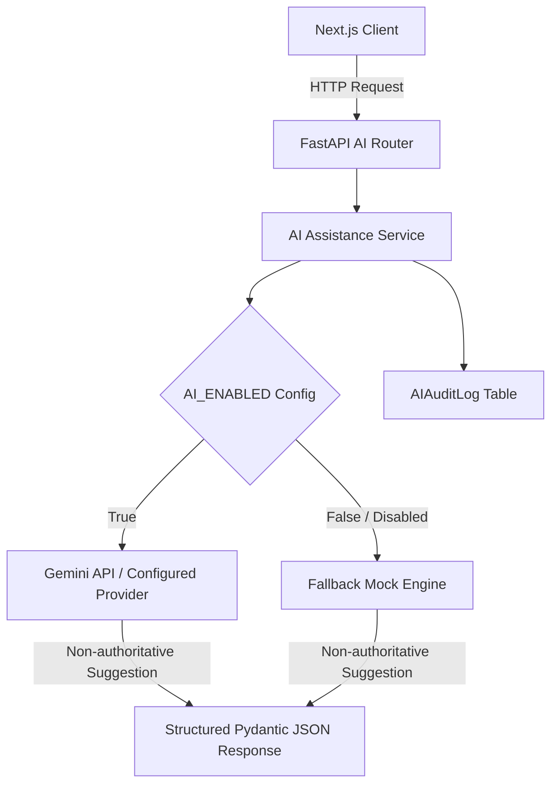

# AI Architecture — NIRNAY

## 1. Overview & Provider Architecture

NIRNAY includes a bounded AI assistance module (`apps/api/app/api/v1/ai_assistance.py` & `apps/api/app/services/ai/`) designed to assist government reviewers and academic partners with data extraction, duplicate detection, and qualification suggestions.

---

## 2. Supported AI Capabilities

1. **Challenge Text Extraction (`POST /api/v1/ai-assistance/extract-challenge`)**: Converts raw, unstructured citizen complaint text into structured challenge fields (title, domain, location, key issues).
2. **Qualification Route Suggestion (`POST /api/v1/ai-assistance/suggest-qualification`)**: Recommends a qualification route (`SERVICE`, `CLARIFY`, `RESEARCH_REVIEW`, `INNOVATION_CHALLENGE`) based on evidence features.
3. **Duplicate Detection (`POST /api/v1/ai-assistance/detect-duplicates`)**: Compares incoming challenge text against active records in PostgreSQL to surface potential duplicates.
4. **HEI Capability Matching (`POST /api/v1/ai-assistance/suggest-hei-matches`)**: Recommends accredited HEIs based on research keywords and lab facilities.
5. **Evidence Summarization (`POST /api/v1/ai-assistance/summarize-evidence`)**: Synthesizes attached evidence files into concise technical summaries.

---

## 3. Provider Configuration

The AI subsystem configuration is defined in `app/core/config.py`:
- `AI_ENABLED`: Master boolean toggle (default `False`).
- `AI_PROVIDER`: Selected provider name (e.g. `gemini`, `disabled`).
- `AI_MODEL`: Active model identifier (default `gemini-2.5-flash`).
- `AI_TIMEOUT_SECONDS`: Request timeout limit (default `15` seconds).
- `AI_API_KEY`: API key credential passed via environment variables.
