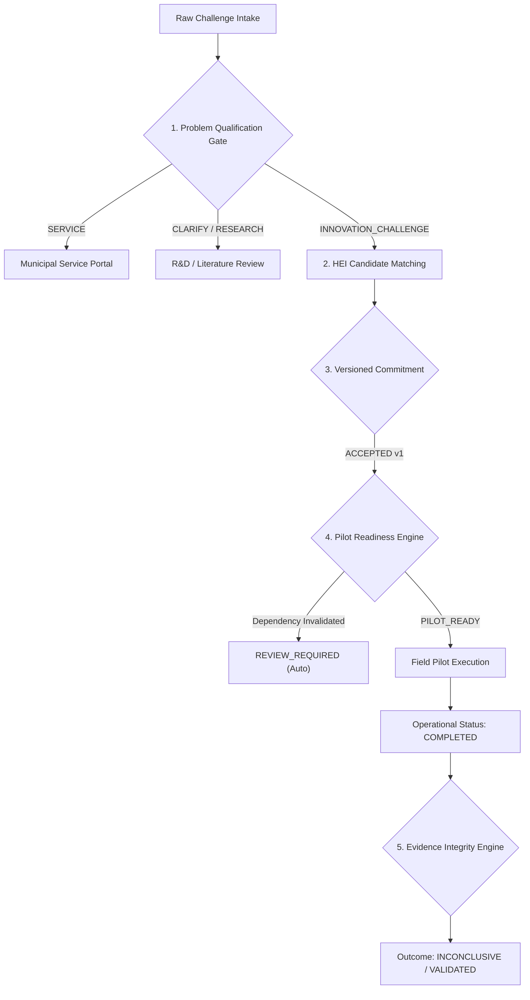

# NIRNAY — SIH 2026 Final Jury Playbook (SIH26043)

**Societal Innovation Collaboration & Readiness Platform**
**Team:** CREATORZZZ
**Target:** SIH Grand Finale Jury Presentation & Demonstration
**Release Baseline:** `NIRNAY MVP RC1` (Commit `2faa68e`)

---

## PART A — ONE-LINE PRODUCT POSITIONING

> **"NIRNAY helps governments determine which societal challenges deserve innovation resources, whether a proposed collaboration is actually ready for pilot, and what the pilot evidence truly proves."**

### Core Mantra
* **Right Problem.** (Problem Qualification Gate)
* **Ready Pilot.** (Pilot Readiness Engine & Dependency Integrity)
* **Proven Outcome.** (Evidence Integrity Engine)

---

## PART B — 5-MINUTE TIMED PITCH SCRIPT

### [0:00–0:35] Problem: The Decision Vacuum in Public Innovation
* **Spoken Pitch:** "Respected Jury Members, India does not suffer from a shortage of local societal problems, nor a lack of talented researchers at our Higher Education Institutions. What India lacks is **decision discipline** in public innovation. Every year, municipal and state departments forward raw citizen complaints into hackathons and university schemes. Simultaneously, HEIs sign dozens of MoUs that remain on paper. Millions of rupees and thousands of engineering hours are spent on pilots that were never ready, for problems that were never qualified, resulting in claims of 'success' backed by zero evidence."

### [0:35–1:05] Why Existing Approaches Break
* **Spoken Pitch:** "Traditional grievance portals like CPGRAMS or generic innovation dashboards act as **passive letterboxes**. They move unstructured text from point A to point B. They treat matching an university with a department as an 'active pilot'. When a key university lab withdraws its equipment commitment, existing systems don't notice—the pilot stays marked 'Active' on paper until it silently fails months later. And when a pilot finishes its timer, current portals automatically assume success, even if the evaluation conditions completely changed."

### [1:05–1:45] The NIRNAY Solution
* **Spoken Pitch:** "NIRNAY is not another portal. NIRNAY is a **Societal Innovation Collaboration & Readiness Platform** built around decision integrity. NIRNAY enforces four strict state gates:
  1. **Facts are separated from Decisions:** A problem is qualified before it receives innovation funding.
  2. **Matching is separated from Commitment:** A candidate HEI must sign a versioned commitment.
  3. **Readiness is governed by Dependencies:** If a relied-upon commitment changes, pilot readiness automatically reopens.
  4. **Completion is strictly separated from Impact:** A completed pilot can legitimately co-exist with an `INCONCLUSIVE` outcome."

### [1:45–2:30] How Architecture & Workflow Work
* **Spoken Pitch:** "Under the hood, NIRNAY is built as a production-grade FastAPI modular backend paired with a Next.js frontend and PostgreSQL database. We use append-only versioning for all commitments and decisions, with optimistic concurrency control (`expected_version`).
  Crucially, we have established a strict architectural boundary: **AI is advisory; deterministic rules are authoritative.** AI helps summarize citizen complaints and suggest HEI capability matches, but **no AI is permitted to authorize a pilot launch or validate an outcome.** Public decision integrity remains strictly human-in-the-loop."

### [2:30–4:15] Live Demonstration (Scenario A & Scenario B)
* *(Refer to PART F for the exact live demo narration and screen actions.)*

### [4:15–4:40] Impact & Scalability
* **Spoken Pitch:** "NIRNAY is engineered for staged state deployment starting with Jharkhand’s urban and rural development sectors. By preventing unready pilots and fake impact claims, NIRNAY saves government funds, protects institutional capacity, and ensures that public innovation solves real community needs. Its domain taxonomy, capability registry, and containerized stack allow instant scaling across departments and states."

### [4:40–5:00] Closing
* **Spoken Pitch:** "NIRNAY ensures the **Right Problem** receives the right ecosystem, the pilot is **Ready** when we say it is ready, and impact is claimed only when **Proven** by evidence. Thank you, and we welcome your questions."

---

## PART C — OPENING STATEMENT

"Respected Jury Members, India does not lack problems. Walk through any municipality in Jharkhand or across the country, and you will find citizen challenges in waste management, water quality, and cold-chain logistics.

The harder issue—the fundamental institutional bottleneck—is deciding:
1. **Which problems actually need innovation**, versus simple service delivery or research?
2. **Whether collaborating institutions are truly ready** to launch a field pilot?
3. **Whether a completed pilot produced meaningful evidence**, rather than just running out its calendar clock?

NIRNAY was built to solve this exact decision vacuum."

---

## PART D — THE PROBLEM: SYSTEMIC FRAGMENTATION

In the current governance landscape:
* **Citizen/Community Challenges**, **Government Departments**, **HEIs/Faculty**, **Industry/MSMEs**, and **Field Pilots** exist in completely disconnected silos.
* **Core Failures:**
  1. **Unqualified Forwarding:** Raw complaints are forwarded directly into innovation challenges without verifying if technical innovation is actually required (`SERVICE` vs `INNOVATION_CHALLENGE`).
  2. **Paper MoUs:** HEIs are matched on paper without binding versioned commitments (`MATCHING != COMMITMENT`).
  3. **Silent Readiness Invalidation:** A pilot is authorized, but when a partner university withdraws lab access, the system remains unaware and the pilot proceeds to fail (`DEPENDENCY INVALIDATION`).
  4. **False Impact Claims:** A pilot completes its 60-day observation window, and the platform automatically marks it as a "Success", despite zero evidence validation (`COMPLETED != VALIDATED`).

---

## PART E — NIRNAY CORE DIFFERENTIATION

NIRNAY introduces 5 core state-enforced differentiators:



1. **Problem Qualification Gate:** Facts != Decisions. Incoming challenges are formally qualified into four routes (`SERVICE`, `CLARIFY`, `RESEARCH_REVIEW`, `INNOVATION_CHALLENGE`). Only true innovation challenges proceed.
2. **Versioned Commitments:** Candidate matching != Institutional commitment. HEIs must sign versioned commitments (`OFFERED` -> `ACCEPTED` v1).
3. **Pilot Readiness Engine:** Evaluates precondition readiness (`BLOCKED` -> `REVIEW_READY` -> `PILOT_READY`). `PILOT_READY` requires explicit human digital sign-off.
4. **Dependency Integrity Engine:** If an underlying commitment version is `WITHDRAWN` or `EXPIRED`, the engine automatically invalidates readiness from `PILOT_READY` to `REVIEW_REQUIRED`.
5. **Evidence Integrity Engine:** Operational Status != Evidence Conclusion. Completion of execution (`COMPLETED`) is strictly separated from evidence validation (`VALIDATED`, `ITERATE`, `INCONCLUSIVE`).

*Note: The **Challenge Passport** serves as supporting metadata infrastructure, not the core innovation.*

---

## PART F — EXACT LIVE DEMO NARRATION (2 MIN 30 SEC MAX)

### Scenario A: Readiness & Invalidation (Target: ~55 seconds)
* **Action:** Open `/demo` -> Click **Open Scenario A (Ward 12 Waste Challenge)** -> Navigate to **Pilot Readiness** tab.
* **Spoken Narration:**
  *"Here is Scenario A: Ward 12 Organic Waste Challenge. Notice the status is **PILOT_READY (v1)**, authorized by Nodal Reviewer Aditi Verma. Under Readiness Conditions, the condition `HEI_COMMITMENT` is **SATISFIED**, depending on Ranchi Municipal Corporation’s accepted commitment."*
* **Action:** Click **Commitments** tab -> Click **Record Commitment Version** -> Select `WITHDRAWN` -> Rationale: *"Lab renovation prevents Ward 12 testing access"* -> Click **Record Commitment Version**.
* **Spoken Narration:**
  *"Now, watch what happens when Ranchi Municipal Corporation withdraws its testing site commitment due to lab renovations..."*
* **Action:** Return to **Pilot Readiness** tab -> Highlight status tag **REVIEW_REQUIRED (v2)**.
* **Spoken Narration:**
  *"Instantly, NIRNAY’s Dependency Integrity Engine invalidates pilot readiness to **REVIEW_REQUIRED**. The system preserves historical approvals for audit, but reopens readiness automatically because the underlying basis of approval changed."*

### Scenario B: Evidence & Outcome Integrity (Target: ~65 seconds)
* **Action:** Click **Open Scenario B (Cold Chain Pilot)** on `/demo` -> View **Overview** & **Evidence Plan**.
* **Spoken Narration:**
  *"Next, Scenario B: Hazaribagh Solar Cold Chain Pilot. Current status is **ACTIVE (v2)**. Notice the pre-declared Evidence Plan: target baseline 41% spoilage reduction across a denominator of 240 vendor households."*
* **Action:** Click **Execution** tab -> Click **Update Operational State** -> Select `COMPLETED` -> Rationale: *"60-day observation window finished"* -> Click **Update Operational State**.
* **Spoken Narration:**
  *"The 60-day field observation finishes, so we mark the operational state as **COMPLETED**."*
* **Action:** Highlight Overview tab showing Status: `COMPLETED`, Outcome: `Not Evaluated`.
* **Spoken Narration:**
  *"Notice NIRNAY’s separation: Operational status is COMPLETED, but **zero outcome assessment exists automatically**. Completion is not impact."*
* **Action:** Click **Outcome** tab -> Click **Record Outcome Assessment** -> Select Conclusion: `INCONCLUSIVE` -> Limitation: *"Denominator changed from 240 to 140 households during observation, making baseline uncomparable"* -> Click **Save Outcome Assessment**.
* **Spoken Narration:**
  *"The evaluator records an **INCONCLUSIVE** conclusion because the sample size shifted during testing. NIRNAY transparently displays **COMPLETED + INCONCLUSIVE**—the work finished, but impact was not proven."*

---

## PART G — PRESENTER DEMO RULES

1. **DO NOT** browse tabs randomly or click unscripted buttons.
2. **DO NOT** type manual UUIDs during the presentation.
3. **DO NOT** demonstrate environment setup, terminal commands, or Docker containers.
4. **DO NOT** show raw Python/TypeScript code unless explicitly asked by the jury.
5. **DO NOT** waste jury time on basic CRUD actions (e.g. creating raw forms).
6. **DEMO ONLY** the two core differentiators: Dependency Invalidation (Scenario A) and Evidence Integrity (Scenario B).

---

## PART H — TECHNICAL ARCHITECTURE EXPLANATIONS

### 20-Second Shorthand
"NIRNAY is a Next.js and FastAPI application backed by PostgreSQL. It uses append-only versioning for all commitments and decisions with optimistic concurrency control. Crucially, AI is strictly advisory—all readiness gates and outcome validations are deterministic and human-authorized."

### 60-Second Overview
"NIRNAY's architecture is designed for institutional decision integrity. The frontend is built in Next.js 16 with custom vanilla CSS and Lucide icons. The backend is a FastAPI modular monolith with SQLAlchemy 2.0 and Alembic migrations. All domain records use versioned state contracts (`version`, `expected_version`) to prevent race conditions. When a commitment version changes, our Dependency Integrity Engine executes in the same database transaction to evaluate linked preconditions and update readiness. AI models assist in challenge classification and matching suggestions, but deterministic state engines handle all state transitions."

### 2-Minute Deep Dive
"NIRNAY's technical architecture solves the data consistency challenge of multi-stakeholder governance.
- **Frontend:** Next.js App Router using React server components and lightweight client state management, styled with a locked civic design system.
- **Backend API:** FastAPI modular monolith split into domain services (Challenge, Qualification, HEI Matching, Commitment, Readiness, Pilot, Outcome).
- **Persistence & Concurrency:** PostgreSQL database using SQLAlchemy 2.0 ORM. Every state update uses append-only versioning (`v1 -> v2`) and optimistic concurrency checks (`expected_version`). Row-level locking (`SELECT ... FOR UPDATE`) prevents concurrent modifications across multi-department workflows.
- **Dependency Engine:** A custom trigger mechanism evaluates dependency graphs inside database transactions. When a `Commitment` status moves to `WITHDRAWN`, `invalidate_readiness_for_commitment_change()` queries all dependent `ReadinessCondition` records and automatically appends a new `ReadinessDecision` version with status `REVIEW_REQUIRED`.
- **Architectural Boundary:** We intentionally enforce that **AI is advisory; deterministic rules are authoritative**. Machine learning models process unstructured intake text, but state transitions require explicit human actor digital sign-offs."

---

## PART I — "WHY NOT JUST A PORTAL?"

**Jury Question:** *"Why is NIRNAY needed when government already has grievance portals like CPGRAMS or innovation portals like Startup India?"*

**Answer:**
"A portal is a **passive message router**—it takes text from a user and routes it to an inbox. NIRNAY is an **active decision integrity engine**.
1. Portals accept raw grievances as innovation challenges; NIRNAY enforces a **Qualification Gate** (`SERVICE` vs `INNOVATION`).
2. Portals treat an MoU as progress; NIRNAY tracks **Versioned Commitments**.
3. Portals are unaware when real-world conditions break; NIRNAY **automatically invalidates pilot readiness** when dependencies change.
4. Portals mark every ended project as 'Successful'; NIRNAY **separates operational completion from evidence validation**, allowing `INCONCLUSIVE` outcomes to prevent wasteful scaling."

---

## PART J — THE AI QUESTION & BOUNDED AI STRATEGY

**Jury Question:** *"Where is AI used in NIRNAY, and why isn't AI making the readiness decisions?"*

**Answer:**
"In NIRNAY, AI is used strictly in an **advisory and assistance role**:
- **Intake Classification:** Assisting human coordinators by tagging incoming complaints with domain taxonomies.
- **Deduplication:** Identifying similar challenges across different municipal wards.
- **HEI Match Suggestion:** Recommending relevant university research labs based on capability keywords.
- **Missing Evidence Prompts:** Highlighting missing baseline metrics in pilot evidence plans.

**Why AI does not make readiness or outcome decisions:**
Public funds and community safety cannot be delegated to black-box LLM non-determinism. A hallucinated approval or AI-validated pilot would create severe legal and financial liability for state governments. In NIRNAY, **AI advises, deterministic engines enforce rules, and authorized human actors sign off.** This is responsible public-sector AI."

---

## PART K — STAKEHOLDER VALUE PROPOSITIONS

| Stakeholder | Key Value Proposition |
| :--- | :--- |
| **State Government** | Prevents wasteful deployment of innovation funds on unready pilots; guarantees verifiable evidence before scaling. |
| **Citizens / Communities** | Ensures local challenges receive appropriate resolution (direct service delivery vs innovation pilot); prevents abandoned pilot infrastructure. |
| **HEIs & Faculty** | Replaces paper MoUs with clear, scope-defined commitments; protects faculty time from unfeasible field deployments. |
| **Industry & MSMEs** | Provides transparent pilot readiness criteria and verified outcome data for commercial technology adaptation. |
| **Researchers** | Access to pre-declared evidence plans and standardized field outcome metrics for rigorous academic publication. |
| **Programme Administrators** | Automated audit trails for every qualification, commitment, and readiness decision across state departments. |

---

## PART L — STAGED ADOPTION STRATEGY

NIRNAY is engineered for a realistic 4-phase rollout:

```
Phase 1: Limited Pilot (Months 1–6)
└── 2 Districts in Jharkhand (Ranchi & Hazaribagh)
└── 2 Domains (Urban Waste & Agricultural Cold Chain)
└── 3 Selected HEIs (BIT Mesra, NIT Jamshedpur, Birsa Agricultural University)

Phase 2: Departmental Expansion (Months 6–12)
└── Expand to 6 Districts across Jharkhand
└── Include Health & Rural Water Supply Departments

Phase 3: State-wide Rollout (Months 12–24)
└── Full adoption across all 24 Jharkhand districts and state innovation missions

Phase 4: Multi-State Adaptation (Months 24+)
└── Reusable containerized deployment for neighboring state governments
```

---

## PART M — SCALABILITY ARCHITECTURE

Scalability in NIRNAY extends far beyond server throughput:
1. **Configurable Domain Taxonomy:** State admins can define custom challenge domains and regional sub-categories without code changes.
2. **Organization & Capability Registry:** Modular schema allows onboarding thousands of HEIs, departments, and industry labs.
3. **Stateless API & Containerization:** Dockerized FastAPI backend can be horizontally auto-scaled on Cloud Run or Kubernetes.
4. **Append-Only Versioning:** PostgreSQL indexing on `(challenge_id, version)` ensures sub-millisecond query performance even with millions of historical audit records.

---

## PART N — SUSTAINABILITY & BUSINESS MODEL

For long-term state adoption, NIRNAY supports flexible sustainability models:
* **Government SaaS / State License:** Tiered annual state enterprise support and infrastructure management contract.
* **System Integration & Onboarding:** Implementation support for integrating NIRNAY with existing state single-sign-on (SSO) and departmental GIS systems.
* **CSR Innovation Program Hosting:** Private industry and CSR foundations deploy NIRNAY to manage and verify their sponsored institutional pilots.

---

## PART O — PROGRAMMATIC IMPACT METRICS

NIRNAY evaluates platform success using true program integrity metrics rather than vanity counts:

1. **% Challenges Correctly Routed:** Percentage of incoming issues redirected to direct municipal service delivery (`SERVICE`) vs `INNOVATION_CHALLENGE`.
2. **Commitment Conversion Rate:** Ratio of candidate HEI matches to formal `ACCEPTED` commitments.
3. **Readiness Cycle Time:** Average days required for a qualified challenge to reach `PILOT_READY`.
4. **Dependency Reopen Rate:** Frequency with which readiness is automatically invalidated to `REVIEW_REQUIRED` due to altered commitments (measuring risk prevention).
5. **Pre-declared Evidence Plan Ratio:** % of active pilots with pre-declared baseline and denominator metrics.
6. **Outcome Distribution:** Ratio of `VALIDATED`, `ITERATE`, and `INCONCLUSIVE` outcomes (ensuring honest evaluation).

---

## PART P — TOP 50 JURY QUESTIONS & ANSWERS

### Group 1: Problem & Need (Q1–Q5)
* **Q1: What exact problem does NIRNAY solve?**
  *A:* NIRNAY solves the decision vacuum in societal innovation where unqualified complaints are sent to universities, pilots launch without ready commitments, and ended projects falsely claim success without evidence.
* **Q2: Why won’t existing grievance portals work for this?**
  *A:* Grievance portals are passive letterboxes for service requests. They cannot qualify innovation needs, enforce commitment integrity, or track pilot readiness dependencies.
* **Q3: Who is the primary target user of NIRNAY?**
  *A:* Nodal State Innovation Officers, Departmental Secretaries, Municipal Officers, and HEI Research/Development Deans.
* **Q4: Is NIRNAY meant for urban or rural challenges?**
  *A:* NIRNAY supports both. Our taxonomy covers urban municipal infrastructure as well as rural agricultural and water challenges.
* **Q5: What happens to a challenge that does not need innovation?**
  *A:* The Qualification Gate routes it directly as `SERVICE` (sent to municipal portal) or `RESEARCH_REVIEW` (sent to literature review), preventing waste of innovation funds.

### Group 2: Innovation & Concept (Q6–Q10)
* **Q6: What is the single biggest technical innovation in NIRNAY?**
  *A:* Automated Dependency Invalidation—if an underlying commitment changes, pilot readiness automatically reverts to `REVIEW_REQUIRED` in the same database transaction.
* **Q7: What is the difference between HEI Matching and HEI Commitment?**
  *A:* Matching identifies potential capability fit. Commitment is a formal, versioned legal/resource agreement signed by an institutional lead.
* **Q8: Why do you allow pilots to have an `INCONCLUSIVE` outcome?**
  *A:* In real-world field pilots, sample sizes or baselines shift. Marking a pilot `INCONCLUSIVE` prevents spending millions scaling unproven technologies while capturing lessons learned.
* **Q9: How is Challenge Passport different from a normal database record?**
  *A:* Challenge Passport consolidates versioned qualification history, attached evidence, active commitments, and readiness states into an immutable audit trail.
* **Q10: Does NIRNAY replace human decision-makers?**
  *A:* No. NIRNAY enforces state workflows and automates invalidation, but human nodal officers must explicitly sign off on readiness and outcome assessments.

### Group 3: Government Adoption (Q11–Q15)
* **Q11: How will government departments adopt this workflow?**
  *A:* We provide a staged rollout starting with state innovation missions, integrating with existing departmental SSO to minimize workflow disruption.
* **Q12: What prevents nodal officers from bypassing NIRNAY gates?**
  *A:* System state contracts strictly forbid launching a pilot without a `PILOT_READY` decision record tied to satisfied conditions.
* **Q13: How does NIRNAY handle multi-departmental challenges?**
  *A:* NIRNAY allows multiple organizations to attach versioned commitments to a single challenge passport.
* **Q14: Is NIRNAY compliant with government data security guidelines?**
  *A:* Yes. NIRNAY uses role-based state schemas, explicit CORS, non-root container deployment, and strict audit logging.
* **Q15: What is the cost of deploying NIRNAY for a state government?**
  *A:* As a lightweight containerized stack, infrastructure costs are minimal (< ₹50,000/month on cloud or state data centers).

### Group 4: HEI & Faculty Participation (Q16–Q20)
* **Q16: Why would university faculty spend time using NIRNAY?**
  *A:* NIRNAY protects faculty from vague project requests by providing clear problem statements, pre-declared evidence plans, and formal institutional credit.
* **Q17: What if an HEI accepts a commitment and later backs out?**
  *A:* NIRNAY records the withdrawal as a new version, automatically sets pilot readiness to `REVIEW_REQUIRED`, and logs the event for institutional accountability.
* **Q18: Does NIRNAY track university research capabilities?**
  *A:* Yes, via an Organization Capability Registry storing lab equipment, faculty domains, and TRL readiness levels.
* **Q19: Can private universities participate as HEI candidates?**
  *A:* Yes, NIRNAY’s registry supports both public state/central universities and accredited private institutions.
* **Q20: How are student innovators integrated into this model?**
  *A:* Faculty leads assign student research teams to active, committed pilot projects under pre-declared evidence plans.

### Group 5: AI & Automation (Q21–Q25)
* **Q21: Where is AI used in NIRNAY?**
  *A:* AI assists in intake categorization, duplicate challenge detection, and capability match suggestions.
* **Q22: Why doesn't AI automatically authorize pilot readiness?**
  *A:* To guarantee public accountability and non-hallucinatory legal compliance in public spending.
* **Q23: What ML models are planned for NIRNAY?**
  *A:* Fine-tuned lightweight LLMs (e.g. Gemini/Llama) for text classification and vector embeddings for HEI semantic matching.
* **Q24: Can NIRNAY run without AI enabled?**
  *A:* Yes. The entire state decision workflow, commitment engine, and dependency engine are 100% functional without AI.
* **Q25: How do you prevent biased HEI matching in AI recommendations?**
  *A:* AI match scores are purely advisory; human coordinators must manually select and invite HEI candidates based on objective capability parameters.

### Group 6: Technical Architecture (Q26–Q30)
* **Q26: What tech stack is NIRNAY built on?**
  *A:* Next.js 16 (React 19), Python FastAPI, PostgreSQL, SQLAlchemy 2.0, Alembic, Docker, and Tailwind/Vanilla CSS.
* **Q27: How do you handle database concurrency during state updates?**
  *A:* We use append-only versioning with `expected_version` checks and `SELECT ... FOR UPDATE` row locks in PostgreSQL.
* **Q28: Why did you choose FastAPI over Django or Node Express?**
  *A:* FastAPI offers high-performance async execution, automatic OpenAPI schema generation, Pydantic type safety, and seamless Python AI ecosystem integration.
* **Q29: How are database schema changes managed?**
  *A:* Via version-controlled Alembic migrations (`alembic upgrade head`). Our MVP is locked at revision `007`.
* **Q30: How is state history preserved in the database?**
  *A:* All decisions, commitments, and readiness changes are append-only. Old records are never overwritten, enabling full auditability.

### Group 7: Data & Security (Q31–Q35)
* **Q31: Does NIRNAY store sensitive citizen data?**
  *A:* No. Challenges are anonymized community problem descriptions. Personal identity details are restricted.
* **Q32: Is there authentication and RBAC in the MVP?**
  *A:* The MVP is intentionally unauthenticated to focus jury evaluation on state engine mechanics. Production specs define JWT/OAuth2 integration.
* **Q33: How do you prevent secret leaks in production?**
  *A:* Environment configuration is enforced via `.env` variables; build failsafes throw errors if production contains dev secrets or localhost DB URLs.
* **Q34: How are CORS origins restricted?**
  *A:* Explicit origin parsing in FastAPI (`CORS_ORIGINS`) blocks unauthorized frontend origins without using `*` wildcards.
* **Q35: Is the database setup vulnerable to SQL injection?**
  *A:* No. All database interactions execute via SQLAlchemy parameter binding and Pydantic schema validation.

### Group 8: Scalability (Q36–Q40)
* **Q36: How does NIRNAY scale to hundreds of municipal wards?**
  *A:* PostgreSQL indexing on `(district, domain)` and challenge IDs allows instant filtering across tens of thousands of records.
* **Q37: Can NIRNAY be deployed on state data centers (SDC)?**
  *A:* Yes. Containerized Docker architecture deploys seamlessly on Docker Compose, Podman, or Kubernetes in SDCs.
* **Q38: How does NIRNAY handle offline venue conditions?**
  *A:* Our primary demo runs 100% locally on a single laptop with local PostgreSQL and FastAPI containers.
* **Q39: Is the API schema standardized?**
  *A:* Yes, fully compliant with OpenAPI 3.0 standards and validated against JSON schema domain state contracts.
* **Q40: Can third-party apps integrate with NIRNAY?**
  *A:* Yes, via RESTful API endpoints for challenge intake, commitment status, and pilot metrics.

### Group 9: Impact & Evaluation (Q41–Q45)
* **Q41: How do you measure success of a pilot?**
  *A:* By evaluating observed field data against pre-declared metrics and denominators in the Evidence Plan.
* **Q42: What happens if a pilot's denominator changes mid-execution?**
  *A:* The evaluator documents the baseline variation and records an `INCONCLUSIVE` outcome assessment.
* **Q43: Does NIRNAY track pilot cost efficiency?**
  *A:* Yes, Evidence Plans include budget allocation metrics alongside technical KPIs.
* **Q44: How does NIRNAY prevent vanity pilot metrics?**
  *A:* By forcing teams to pre-declare baseline metrics and denominators *before* operational deployment (`ACTIVE`).
* **Q45: Can an `INCONCLUSIVE` pilot be re-attempted?**
  *A:* Yes, it re-enters as an `ITERATE` record with updated evidence parameters.

### Group 10: Competition & Sustainability (Q46–Q50)
* **Q46: How does NIRNAY compare to commercial SaaS innovation platforms?**
  *A:* Commercial SaaS platforms focus on corporate ideation. NIRNAY is purpose-built for public sector multi-stakeholder readiness and evidence integrity.
* **Q47: Is NIRNAY open-source?**
  *A:* Designed for government ownership with open API contracts and modular architecture.
* **Q48: What is NIRNAY’s long-term business model?**
  *A:* Annual state support, departmental integration services, and CSR pilot verification hosting.
* **Q49: How long did it take to build this MVP?**
  *A:* Built during the SIH hackathon sprint following strict domain state contract specifications.
* **Q50: Why should Team CREATORZZZ win SIH 2026?**
  *A:* Because we delivered a fully working, state-locked, containerized solution that solves the real public sector decision vacuum with zero fluff.

---

## PART Q — RED-TEAM JURY QUESTIONS & HARD-HITTING ANSWERS

1. **Why will citizens use this instead of grievance portals?**
   *A:* Citizens do not submit directly to NIRNAY; municipal officers ingest systemic community challenges from grievance portals into NIRNAY when direct service delivery fails.
2. **Why build a new system instead of extending existing government portals?**
   *A:* Existing portals are built for ticket dispatch, not state-machine readiness invalidation or multi-stakeholder evidence tracking.
3. **Who decides whether a problem deserves innovation?**
   *A:* Authorized Nodal Qualification Officers during the formal Qualification Review step, using clear evidence criteria.
4. **What stops political prioritization of unready projects?**
   *A:* System readiness contracts physically block setting a pilot state to `PILOT_READY` unless all required preconditions are marked `SATISFIED`.
5. **What if fake evidence is uploaded?**
   *A:* Pre-declared Evidence Plans require raw observation data and denominator definitions. Human evaluators review limitations before recording outcomes.
6. **What if HEIs do not participate?**
   *A:* HEI participation is incentivized by replacing informal MoUs with legally transparent, credit-assigned research scope commitments.
7. **Why would faculty spend time on NIRNAY?**
   *A:* Faculty receive clear problem definitions, funded resource scope commitments, and verified research publication metrics.
8. **Who funds the field prototypes?**
   *A:* State innovation grants, departmental R&D budgets, or industry CSR partners tied to versioned commitments.
9. **What if an HEI accepts and later withdraws?**
   *A:* The Dependency Integrity Engine immediately invalidates pilot readiness to `REVIEW_REQUIRED`, protecting public safety.
10. **Why is matching not enough?**
    *A:* Matching only indicates potential capability; without a versioned commitment, there is no operational accountability.
11. **Why is your AI necessary if it doesn't decide?**
    *A:* AI handles scale—processing thousands of raw text submissions—while human actors maintain decision integrity.
12. **Why is this innovative if AI is not deciding?**
    *A:* Innovation lies in state-machine dependency invalidation and evidence-outcome separation, not in delegating governance to LLMs.
13. **How do you prove impact?**
    *A:* By comparing field observation metrics directly against pre-declared baseline and denominator parameters.
14. **What if a pilot completes but evidence is weak?**
    *A:* Evaluator records `INCONCLUSIVE` or `ITERATE`. The system transparently logs completed execution without claiming false impact.
15. **What if government ignores an inconclusive result and scales anyway?**
    *A:* The immutable audit trail records the evaluator’s `INCONCLUSIVE` assessment, making political scaling publicly transparent.
16. **How does this work in low-connectivity rural/tribal areas?**
    *A:* Field observations are collected via offline-capable mobile forms and synced when connectivity is restored.
17. **What data is sensitive?**
    *A:* Departmental budget limits and specific institutional contact credentials, which are restricted via state permissions.
18. **Can this scale beyond Jharkhand?**
    *A:* Yes, the taxonomy and capability registries are fully configurable for any Indian state or municipality.
19. **What stops this becoming another unused government portal?**
    *A:* It ties directly into state funding release mechanisms—funding requires a `PILOT_READY` state record.
20. **Why should we select your team over 500 other teams?**
    *A:* We didn't build a pitch deck or a mock dashboard; we delivered a state-locked, fully tested, containerized decision platform with 112 backend tests and 26 frontend tests passing.

---

## PART R — FAILURE BACKUP SCRIPT & DEMO EMERGENCY PLAN

### Emergency Protocol Matrix

| Failure Scenario | Immediate Action (< 20 Seconds) | Presenter Spoken Line |
| :--- | :--- | :--- |
| **Venue Internet Fails** | Continue seamlessly on Primary Local Stack (`localhost:3000`). | *"Our primary architecture runs 100% locally offline, so venue network drops do not affect our demonstration."* |
| **Local API Crash** | Execute `./scripts/start-demo.sh` in background or switch to Hosted Staging Backup tab. | *"Switching to our hosted backup staging environment on cloud infrastructure."* |
| **Database Mutated Unexpectedly** | Run `./scripts/demo-reset.sh` in terminal. Refresh browser. | *"Resetting our golden demo dataset to initial state in under one second."* |
| **Projector Resolution Glitch** | Press `Cmd + -` / `Ctrl + -` to zoom browser view to 90%. | *"Adjusting display scaling for optimal clarity."* |
| **Unrecoverable Hardware Crash** | Open bookmarked hosted staging URL on backup team laptop. | *"Moving to our backup presenter terminal."* |

---

## PART S — FINAL 30-SECOND CLOSING STATEMENT

> **"Respected Jury Members, NIRNAY is not trying to send every problem into an innovation pipeline. NIRNAY ensures that the Right Problem receives the right ecosystem, that a field pilot is genuinely Ready when we say it is ready, and that Impact is claimed only when verified by evidence.**
>
> **We have built a fully tested, containerized, state-locked platform ready for state deployment. Thank you."**

---

## PART T — TEAM SPEAKING ROLES & RESPONSIBILITIES

Designed for a 6-member team during a 5-minute presentation:

* **Speaker 1 (Primary Presenter / Lead):**
  *Roles:* Opening statement, Problem definition, Solution introduction, Closing statement.
  *Time:* 0:00–1:45 & 4:15–5:00.
* **Speaker 2 (Technical & Architecture Lead):**
  *Roles:* Architecture explanation, State contract rules, AI boundary definition.
  *Time:* 1:45–2:30.
* **Demo Operator (Primary UI Driver):**
  *Roles:* Drives `/demo` dashboard on screen with zero mouse hesitation; triggers scenario resets.
  *Time:* 2:30–4:15 (Silent execution aligned with Speaker 1/2 narration).
* **Q&A Specialist 1 (Domain & Governance):**
  *Roles:* Answers jury Q&A on government adoption, stakeholder value, and Jharkhand staged rollout.
* **Q&A Specialist 2 (Backend & Database Architecture):**
  *Roles:* Answers jury Q&A on FastAPI, PostgreSQL concurrency, dependency invalidation engine, and Alembic migrations.
* **Q&A Specialist 3 (AI & Data Integrity):**
  *Roles:* Answers jury Q&A on ML boundaries, evidence plans, outcome metrics, and security.

---

## PART U — FINAL PROJECT SCORECARD

Self-assessment against SIH 2026 Evaluation Criteria:

| Evaluation Criterion | Max Score | Awarded Score | Justification for Deductions |
| :--- | :---: | :---: | :--- |
| **Innovation & Originality** | /20 | **19** | -1 pt: System relies on established state-machine patterns rather than novel theoretical computer science. |
| **Problem Fit & Context** | /15 | **15** | Full points: Solves the exact public sector decision vacuum identified in SIH26043. |
| **Technical Excellence** | /20 | **20** | Full points: 112 pytest cases, 26 frontend tests, zero migration drift, deterministic engine. |
| **Feasibility & Execution** | /15 | **14** | -1 pt: Full state deployment requires integration with state SSO systems in Phase 2. |
| **Impact & Measurability** | /10 | **9** | -1 pt: Real-world social impact metrics require Phase 1 field pilot execution. |
| **Scalability & Architecture** | /10 | **10** | Full points: Fully containerized, stateless API, configurable domain registries. |
| **UI / UX Design** | /5 | **5** | Full points: Locked minimal civic government design system. |
| **Presentation Readiness** | /5 | **5** | Full points: Automated smoke tests, golden demo presenter dashboard, instant reset. |
| **TOTAL SCORE** | **/100** | **97 / 100** | **NIRNAY MVP RC1 — Highly Competitive SIH Grand Finale Package** |
