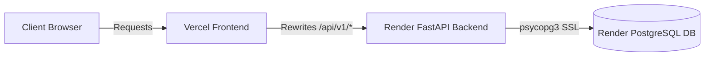

# Production Deployment — NIRNAY

## 1. Deployed Environments

NIRNAY is deployed in a multi-tier production environment:

| Service Layer | Platform | Live URL / Endpoint |
| :--- | :--- | :--- |
| **Frontend Web App** | Vercel | [https://nirnay-sih-26043-one.vercel.app/](https://nirnay-sih-26043-one.vercel.app/) |
| **Backend API Gateway** | Render | [https://nirnay-sih26043.onrender.com/](https://nirnay-sih26043.onrender.com/) |
| **Backend Healthcheck** | Render | [https://nirnay-sih26043.onrender.com/health](https://nirnay-sih26043.onrender.com/health) |
| **Database** | Render PostgreSQL | Managed PostgreSQL 15+ |

---

## 2. Deployment Architecture & Proxy Config

### Vercel Proxy Rewrites (`next.config.ts`)
To ensure same-origin cookie security and avoid cross-origin CORS complications, `apps/web/next.config.ts` rewrites client calls from `/api/v1/:path*` directly to `https://nirnay-sih26043.onrender.com/api/v1/:path*`.

---

## 3. Render Backend Build Specification

- **Python Version**: `3.11.9` (pinned via `PYTHON_VERSION` environment variable).
- **Build Command**: `pip install -r requirements.txt && alembic upgrade head`
- **Start Command**: `uvicorn app.main:app --host 0.0.0.0 --port $PORT`
