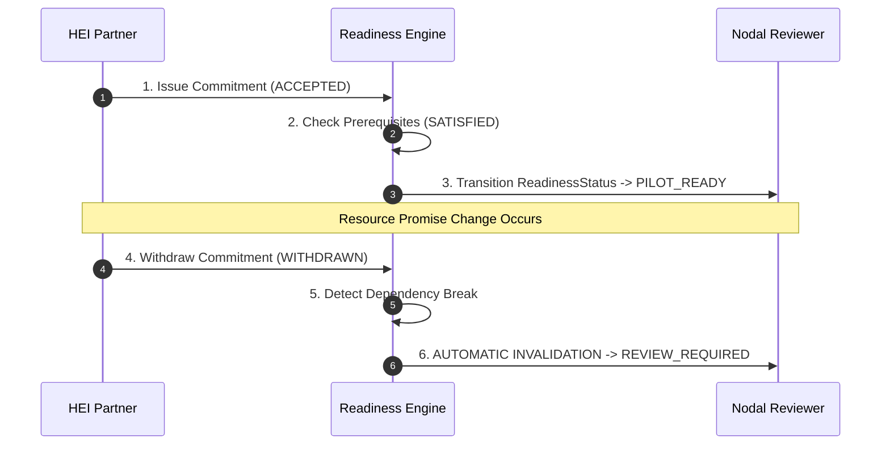

# Hero Scenarios — NIRNAY

## 1. Scenario Overview

NIRNAY validates its core product thesis through two primary **Hero Scenarios** built into both unit test suites and the interactive Jury Evaluation Workspace (`/app/evaluation`).

---

## 2. Scenario A: Automated Readiness Invalidation

### Problem
In conventional portal setups, when a funding partner or university lab withdraws its resource promise during pilot preparation, the project state remains listed as "Ready" in government dashboards.

### NIRNAY Solution Sequence



1. **Initial State**: HEI accepts a commitment (`ACCEPTED`), site access is marked `SATISFIED`. The platform sets `ReadinessStatus = PILOT_READY`.
2. **Invalidation Event**: HEI partner withdraws commitment (`WITHDRAWN`).
3. **Automated Reaction**: The readiness engine intercepts the change and automatically invalidates readiness to `ReadinessStatus = REVIEW_REQUIRED`.
4. **Audit History Preserved**: Previous readiness decisions remain preserved in immutable history; new decision receipt issued.

---

## 3. Scenario B: Structural Separation of Completion vs. Impact

### Problem
A pilot project reaching its physical completion date is often reported as an automatic success, obscuring inconclusive or negative impact evidence.

### NIRNAY Solution Sequence

```
+-----------------------------------------------------------------------------+
|                     PILOT OUTCOME INTEGRITY ASSESSMENT                      |
+-----------------------------------------------------------------------------+
|  Operational Status:  [ COMPLETED ]  (Execution phase timeline finished)    |
|  Evidence Conclusion: [ INCONCLUSIVE ] (Impact data failed baseline check)  |
|                                                                             |
|  Governance Action:   Pilot marked COMPLETED in field logs, but REJECTED   |
|                       for state scaling until evidence is VALIDATED.        |
+-----------------------------------------------------------------------------+
```

1. **Operational Transition**: Pilot operational state advances: `PLANNED` → `ACTIVE` → `COMPLETED`.
2. **Evidence Evaluation**: Reviewer assesses field metrics against baseline definitions in `PilotEvidencePlan`.
3. **Outcome Conclusion**: Reviewer assigns `EvidenceConclusion = INCONCLUSIVE`.
4. **Governance Rule**: The system explicitly displays `OperationalStatus = COMPLETED` alongside `EvidenceConclusion = INCONCLUSIVE`, preventing false claims of proven impact.
