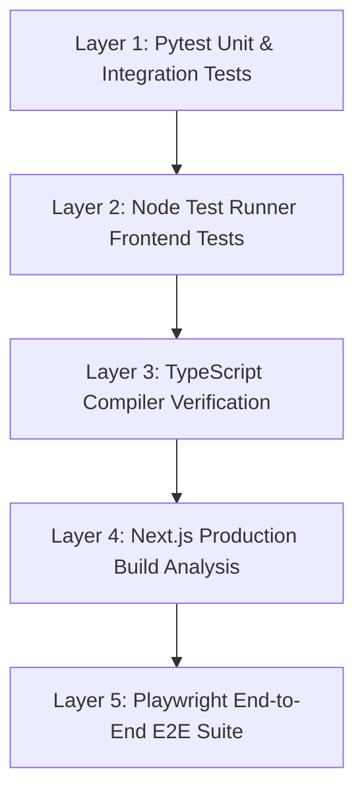

# Testing Strategy — NIRNAY

## 1. Multi-Layer Validation Architecture

NIRNAY employs a multi-tiered validation strategy to ensure technical correctness, domain integrity, and security across all layers:

---

## 2. Test Layer Breakdown

### Layer 1: Backend Unit & Integration Tests (`apps/api/app/tests/`)
- Framework: **Pytest 8.x** with FastAPI `TestClient`.
- Scope: Database models, authentication, Argon2id cookie security, RBAC authorization matrix, qualification versioning, commitment concurrency, readiness invalidations, pilot operational transitions, decision assurance receipts, and AI boundaries.
- Verified Count: **170 / 170 passed**.

### Layer 2: Frontend Unit Tests (`apps/web/test/frontend.test.mjs`)
- Framework: Native **Node.js Test Runner**.
- Scope: Factual data fallbacks, API client response schemas, qualification route validation, commitment concurrency error handling, readiness condition dependencies, hero scenario invalidation checks, and Guided Mission Mode state structures.
- Verified Count: **31 / 31 passed**.

### Layer 3: TypeScript Typecheck (`apps/web`)
- Command: `npm run typecheck` (`tsc --noEmit`).
- Scope: Strict type-safety across all 32 App Router pages, components, API client types, and custom context hooks.
- Result: **0 errors**.

### Layer 4: Next.js Production Build Compilation (`apps/web`)
- Command: `npm run build` (`next build`).
- Scope: Full Turbopack compilation and static HTML prerendering verification for all application routes.
- Result: **32 / 32 static & dynamic routes compiled**.

### Layer 5: Playwright E2E Test Suite (`apps/web/e2e/`)
- Framework: **Playwright 1.63**.
- Scope: User login/register flows, challenge reporting, nodal qualification, HEI commitment submission, readiness checks, pilot lifecycle, jury workspace scenarios, and security boundaries.
- Test Files: 11 dedicated spec files (`01-landing.spec.ts` through `11-jury-evaluation.spec.ts`).
